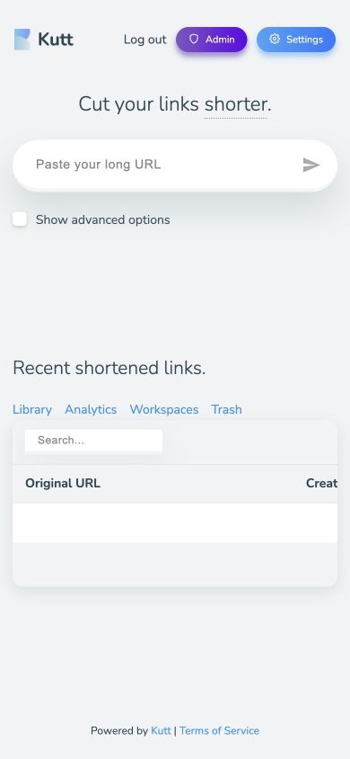
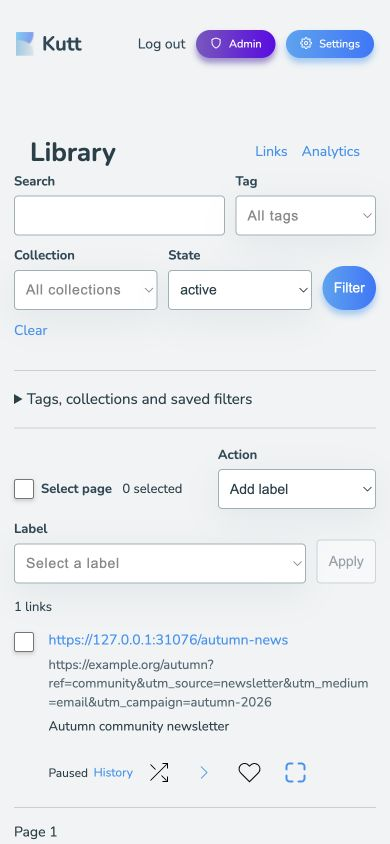
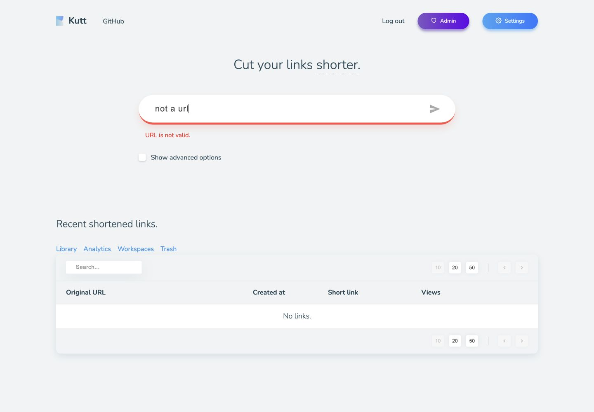
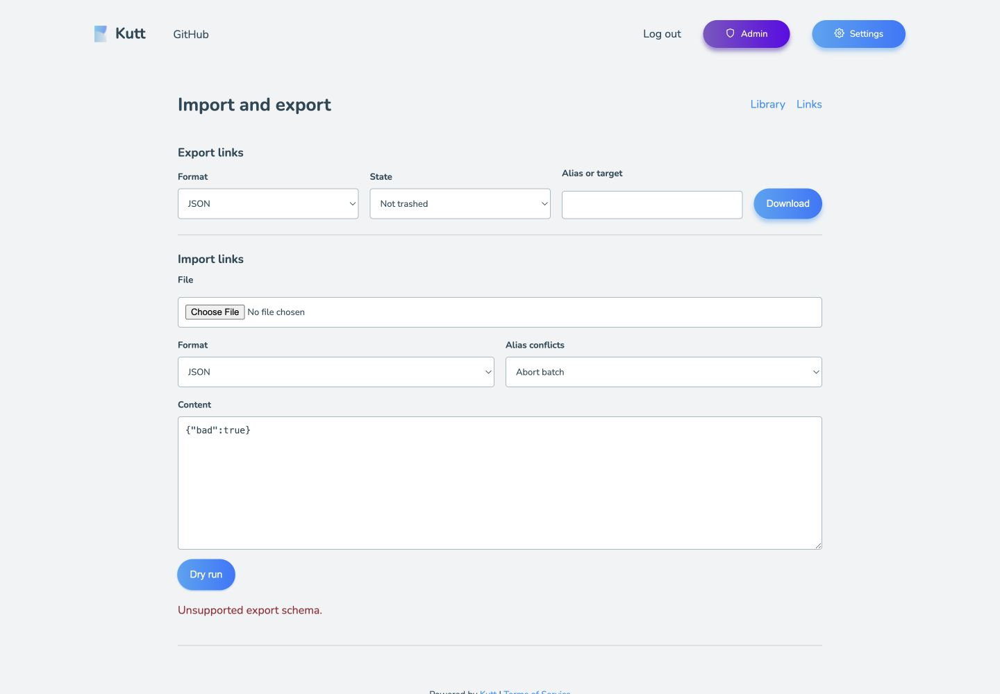
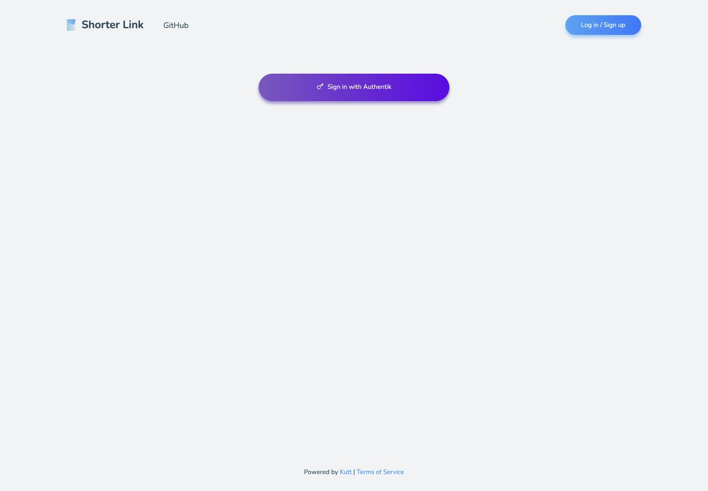

# UI/UX Review And Remediation Ledger

Last updated: 2026-09-18 (Europe/Paris).

**Status: 22 of 23 confirmed findings are verified/closed; UX-023 is implemented and being release-validated. User-assisted audit acceptance remains open.**
UX-001 through UX-022 are verified/closed. Remaining concerns and workflow
coverage are tracked below. Do not describe this as a completed accessibility audit.
The ordinary rendered workflows now have bounded coverage. The explicit
AUDIT-00 remainder below separates external acceptance gates from regression
tests for already-confirmed defects; do not restart passing workflows or invent
unspecified "remaining variants" on each continuation.

**Latest progress:** the user authorized starting all fixes on 2026-09-17. UX-015
now omits unchanged relative expiry, rejects explicit stale expiry changes
transactionally, retains the draft and supports deliberate conflict review/retry.
Release `.19.2` and its CI passed; exact-image browser/restore/scan checks passed.
Full wrapper regression, deployment, public WAF/OIDC checks, post-change health
and post-release restore passed. UX-018/019/020 passed the same gates in `.20`.
UX-017 passed publication, exact deployment, live validation and post-backup restore in `.21`.
UX-001/013 passed publication, exact deployment, live validation and post-backup restore in `.22`. UX-003
passed publication, exact deployment, live validation and post-backup restore in `.23`. UX-002
passed those gates in `.24`. UX-008 passed publication, exact-image regression,
deployment, live checks and clean post-backup writable recovery in `.25`.
UX-004 accurate lifecycle labels and bulk-result feedback passed the same gates in `.26.1`.
UX-005 validation semantics, focus and draft recovery passed every release and
deployment/recovery gate in `.27`. UX-006 import templates and actionable
format errors passed all deployment/recovery gates in `.28`. UX-007 configuration-aware login copy passed all gates in `.29`.
UX-009 local webhook errors passed every release/deployment/recovery gate in `.30`.
UX-010 readable palette changes passed all release/deployment/recovery gates in `.31`.
UX-011 clipboard remediation passed release, exact rendered/runtime, deployment
and clean recovery gates in `.32`.
UX-014 response validation passed every release/deployment/recovery gate in `.33`.
UX-016 single-navigation login and UX-012 unavailable-recipient pages passed all
release, exact-image, deployment and clean post-backup recovery gates in `.35.1`.
Compact-header crowding and the newly confirmed Account security heading issue
passed all release, exact-image, live and clean recovery gates in `.36.1` as UX-021/022.
A-01 native preview subsequently passed with fresh rendered evidence on
2026-09-17. A-02..A-04 remain open; automated evidence does not waive those checks.

## Feature And Deployment Gate

- All 16 items in [FEATURE-ROADMAP.md](FEATURE-ROADMAP.md) are complete.
- Selected community improvements through `v3.2.6-sr94.18` are implemented;
  optional deferred proposals in [UPSTREAM-PR-REVIEW.md](UPSTREAM-PR-REVIEW.md)
  are not prerequisites for this audit.
- Source reviewed: `ecb23daa1b4a6fa10c3ec3dd59470ec882e1be3f`, package
  `3.2.6-sr94.18`. The checkout was clean and synchronized before the audit.
- Baseline at audit start: container `kutt`, image `local/kutt:3.2.6-sr94.18`,
  healthy, zero restarts. Exact wrapper image:
  `sha256:17639101731d1f741b6e596c0f975ad46ee46a87455394a4759965a847116114`.
- Initial audit production observation was limited to the public login page and container
  inspection. All creation, editing, bulk-action and import exercises used an
  isolated instance of that exact image, a fresh temporary SQLite database and
  synthetic `example.org` / `example.invalid` data. No real user data was copied.
- The fixture was loopback-only through SSH, non-root, read-only, with all
  capabilities dropped. Local fixture login replaced OIDC only in the disposable
  instance. A later separate exact-image fixture used a synthetic loopback OIDC
  provider for outage/cancellation tests, as detailed below. Production WAF, SSO,
  routes and secrets were not changed.

## Method And Evidence Limits

Current-run Codex in-app browser captures at desktop 1440 x 1000, tablet
768 x 1024, and mobile 390 x 844 / 320 x 720, with DOM/accessibility snapshots and targeted source review. Screenshots
linked below were opened and visually inspected during this audit. They are not
recycled release-test evidence. The evidence uses synthetic identities and links.

The in-app browser stalled when the Library bulk-trash action opened a native
confirmation. The dialog API did not return the pending dialog; subsequent
interaction and capture commands timed out, including after trying a fresh tab.
This is an **audit-tool blocker**, not evidence of a Kutt production outage or a
confirmed application defect. Approval to finish using the installed standalone
Playwright browser was initially pending. The 2026-09-16 user continuation was
explicitly treated as approval for that isolated-fixture browser only; this does
not authorize production credential changes or irreversible actions.

On the next continuation, the temporary tabs had been cleaned up and a fresh
in-app tab worked. The audit resumed there, without standalone Playwright, using
a new disposable database on the same exact image. Intermittent pre-dispatch
input timeouts remain. Some high-level screenshots incorrectly scale the page
into one quarter of the canvas; those captures are rejected. The same tab's
supported CDP `Page.captureScreenshot` produced correctly sized accepted captures.
No browser permissions or production controls were changed. The supported raw
CDP surface rejected browser clipboard-permission simulation. Subsequently,
temporary failure injection into the disposable document, through the same tab's
supported `Runtime.evaluate`, allowed testing application rejection handling
without changing saved browser permissions. Reload removed the clipboard override
and its absence was verified. A similarly scoped fetch override tested one
synthetic 401 response for rule saving; remaining input commands timed out, so the
unexecuted fault matrix is not counted. The override was removed and a normal
save succeeded before the tab was closed. No standalone browser was used in that
earlier segment; the later approved zoom/print pass is recorded separately below.

Initially, an unsettled mobile viewport capture and a malformed full-page stitched
capture were rejected. Later incorrectly scaled/duplicated captures were also
rejected; only accepted, visually inspected images are linked here. The later
desktop/mobile QR captures supersede the initial unsuccessful QR navigation.

Native Library confirmation was subsequently exercised using the same tab's
supported CDP dialog events and handler, with the keyboard action initiated before
waiting for the dialog. Cancel preserved selection/focus; confirm moved exactly
one synthetic link to trash. This was not a browser-permission change. The separate
Restore action then stalled on its HTMX native confirmation: input, snapshots,
the supported dialog handler and closing the tab timed out while setting focus
emulation; the high-level dialog API returned no dialog. No duplicate restore
action was sent. API inspection confirmed that it had not restored the link.
An explicit API restore succeeded, preserved its pause, and left trash empty.
That initial browser Restore acceptance remained open; the later successful
rendered test below supersedes this blocker. Do not infer an application outage
from the tooling stall.

In a later fresh tab, Restore's native confirmation was observed through the
same tab's CDP event stream. Cancel left the synthetic paused link in Trash.
Initiating the observed button activation without awaiting it, then accepting
the exact pending confirmation in the same invocation, completed successfully.
The rendered article said `Restored. Paused`; an independent API check found no
trashed link and the public URL still returned 410. Reload displayed
`Links: 0` and `Trash is empty.` This validates the rendered action and response,
not an end-to-end keyboard Restore path. No API restore was used in this test.

A fresh tab subsequently resumed from the integrity-checked synthetic checkpoint.
Some semantic pointer/key actions still timed out or had no effect; the same
tab's supported CDP activated the already-observed form controls successfully.
Those saves validate rendered forms and responses, not genuine pointer or
keyboard acceptance. Editor login and a shared-description save passed; owner
controls remained absent. Forwarding save/preview and tracking save/reload passed.
Tracking was restored to its original enabled value. Retention was previewed only;
no deletion was applied. The fixture remained isolated and production unchanged.

Forwarding was then exercised with document-local fetch faults: JSON 403/409,
HTML 503, a rejected network promise, HTML 200, and a manually released pending
request. No injected PUT reached the server. The first four preserved the draft
and reported failure; HTML 200 falsely reported success (UX-014). Two activations
while pending produced only one request and disabled editing until completion.
All overrides were removed and their absence checked. Reload proved the failed
draft was not persisted, and an ordinary save subsequently succeeded.

An actual independent authenticated API client then saved the unchanged forwarding
policy, advancing its revision from 2 to 3 while the rendered editor retained the
old revision. The browser save was rejected with the conflict/reload message.
The first draft-setting expression had a syntax error and is not counted; after
correcting it and verifying the edited textarea, a second stale save preserved
`audit_conflict` in the draft and again reported conflict. Explicit Reload
restored the unchanged server allowlist and a normal browser save succeeded.
No response override or mocked 409 was used for this case.

The paused viewer link also exercised two ordered mobile routing rules. Moving
the second rule up changed preview to that rule's destination. Browser Save
persisted the order at revision 1. An independent authenticated client saved the
unchanged rules at revision 2; the stale browser save reported
`Routing changed elsewhere. Reload before saving.` and retained the edited name.
Canceling Reload retained that draft; accepting Reload recovered the saved names,
and a normal Save advanced to revision 3. The temporary rules were then removed
through the fixture API at revision 4 and the browser showed `No routing rules`.
The link stayed paused/public 410 throughout. No real links or response mocks
were used. Native dialog event handling, not genuine keyboard activation, was
used for the reload confirmations.

Reduced-motion emulation was supported by the same tab's CDP surface and
`matchMedia` confirmed it was active. The 320px Shortcut setup page had no
horizontal document overflow; that page, settled Recent links and the routing
editor had no active animations at the measured moments. This is limited state
coverage, not proof that every loading/hover transition respects the preference.
The high-level screenshot incorrectly rendered at half scale and was rejected;
the accepted CDP capture is linked below. Emulation and viewport overrides were
reset afterward. No Shortcut token was created and the Apple Shortcuts app was
not used. A genuine Tab focused the homepage link and Return later opened the
focused Settings link, but intervening input batches still timed out; this is
partial keyboard evidence, not a complete keyboard-only workflow.

A fresh outsider session saw no workspace or pending invitation, and direct
workspace navigation returned 404 without shared content. A fixture-only API
client invited that synthetic account as a viewer; pending access remained 404.
The rendered Decline action removed the invitation without granting access.
After a second invitation, rendered Accept opened the read-only workspace;
independent API checks rejected viewer writes. Promotion through the fixture API
made editor controls appear after refresh. With a description draft open, a
subsequent API downgrade to viewer caused the rendered Save to reject the write,
show `Your workspace role does not permit this action.` and remove editing
controls. The persisted description stayed unchanged. At 390px the role error
was visible above the workspace with no horizontal document overflow. Revocation
then removed both page and API access; the original synthetic membership set was
restored. These role changes touched only disposable accounts and test links.
The helper initially expected 200 from a successful role update; the actual 204
was checked against the handler, the assertion corrected, and current role
verified before continuing. No duplicate promotion was sent. Native Decline
activation timed out before dispatch; supported same-tab page control activation
completed the rendered form tests, not genuine pointer/keyboard acceptance.
Later ordinary owner-side controls also worked: Invite created a pending viewer
invitation; native revoke Cancel preserved it and Confirm removed it, returning
to All workspaces. Saving the existing synthetic viewer's role as Editor persisted
after reopening management; saving Viewer restored the original role. Read-only
database inspection confirmed exactly the original editor/viewer memberships,
both accepted, with no outsider membership. One semantic value-read timed out;
a same-tab DOM read verified the value before the restoration action continued.

Ordinary in-app controls subsequently worked for the Library: assigning the audit
collection to one selected link added its badge; filtering by that collection
returned exactly that link. Replacing a saved filter, clearing the current filter
and reopening the saved filter retained the new collection criterion. Removing
the assignment yielded zero matching links without deleting the link. The
original tag-based saved filter was restored. A verified six-link checkpoint was
taken before adding 51 paused pagination-only links. Their API pages contained
50 and 1 distinct results. The rendered first page selected exactly its 50 rows;
Next showed one unselected row, Previous and no Next. Enter in a narrowed Search
reset page 2 to page 1 with one matching unselected result. These successful
semantic pointer/keyboard actions do not erase the earlier tool failures or
complete keyboard-only audit coverage.

QR download activation in the fresh tab again produced no verified PNG/SVG file;
the SVG attempt also produced no captured network response or failure event.
Delivery therefore remains unverified, not reported as an application failure.
The rendered 512px preview was independently decoded from its canvas pixels with
the repository's QR decoder, yielding exactly the displayed public short URL and
not the destination. The first ES-module import of the CommonJS decoder failed;
loading it with `createRequire` succeeded. Print-media emulation hid the controls
and heading while retaining the loaded QR sheet. Screen media was restored; no
printer dialog, print job or physical scan was performed. Console history also
contained the existing C-07 HTMX swap error around both local sign-ins; neither
prevented the audited navigation or saved actions, and its cause remains open.

Before the 2026-09-16 zoom pass, no screen-reader, physical iPhone/Safari, browser
zoom, actual clipboard permission-denial or fresh human MFA acceptance was claimed. The
clipboard test injected a rejected promise into the disposable document only.
The native file chooser timed out with both observed file-input activation
methods. Import testing continued through the visible Content field; it is not
counted as file-chooser acceptance. The export download event also timed out,
but the file actually arrived in Downloads: fresh timestamp, JSON schema 1,
1,680 bytes and exactly the two expected synthetic links were verified. Conversely,
PNG/SVG download activations produced no verified new file under the advertised
filenames; their actual browser-download acceptance remains open. A pre-existing
unrelated `qr-code.png` was identified by its old timestamp and left untouched.
DOM names are evidence of semantics, not
proof of complete assistive-technology compatibility. Historical regression tests
do not replace the missing fresh audit steps.

## Workflow Coverage

Additional settled-login and recovery checks used a fresh fixture session. Normal
typing and semantic fill again focused fields without entering text; supported
same-tab control activation submitted the existing synthetic credentials. Waiting
for the delayed login redirect to finish, without an intervening navigation,
reached the populated home page with no captured console errors. This did not
reproduce C-07, but does not establish the cause of its earlier occurrences.
Native Tab focused the unnamed create button, then Advanced options; Space
expanded the latter. This is partial keyboard evidence, not a complete login or
link-creation workflow. The button's missing name remains UX-001; an outline-only
style read is not enough to judge its complete focus appearance.

Campaign draft changes did not alter the destination before Apply. A long value
containing spaces, `&` and `/` applied correctly while retaining encoded path
`/a%2Fb`, unrelated query `keep=a%26b` and fragment `#section%20two`. Clear removed
only campaign parameters and emptied their fields. Both actions explicitly said
`Changes not saved yet.` No link was created. Ordinary click dispatch failed;
the same tab's supported page-control activation completed these rendered checks.

For a real live-activity interruption, only the loopback fixture's SSH tunnel was
terminated. The rendered status changed from `Connected` to `Reconnecting...`
while retaining 21 entries. Reopening that tunnel restored `Connected` without
reloading the page. An independent fixture client saved an unchanged forwarding
policy at a newer revision, producing one fresh event; the browser then contained
22 unique event IDs, with the new event first. No response or EventSource mock
was used. At 390 x 844, the status and wrapped event list fit without horizontal
document overflow. This tests transport recovery, not expired SSO or revocation.

QR image copying was tested with a document-local held/rejected clipboard promise.
Two activations called the clipboard once; the control was disabled and exposed
`aria-busy=true` with `Copying...`. Rejection produced
`Could not copy image. Retry or download PNG.` in a status region, then re-enabled
the control and cleared busy state. The mobile feedback was visible. Reload
removed the audit function/markers and restored the browser's clipboard wrapper;
its normal own-property implementation is not itself evidence of a remaining
override. No clipboard content or browser permission was changed.

Native controls later worked long enough for an uninterrupted keyboard-only link
creation at 390px, followed by desktop Tab/Enter navigation into that link's editor
and typing/Enter to save `Keyboard save verified`. The row and success message
confirmed persistence. The next Tab reached Availability. Reverse-tab navigation
timed out and reset the controller, but inspection of the same tab established
that focus had reached Description. Keyboard select-all/typing then entered a
different draft; Tab reached Close and Enter removed the editor, leaving the
saved description unchanged. No pointer or programmatic field activation was
used in that create/edit/cancel sequence. The timeout and missing action names
are not erased by its successful recovery. This validates these specific paths,
not every keyboard/role/error variant. Captured console errors were empty after
the final cancel. The extra link exists only in the disposable fixture.

The next resumed fixture exercised destination monitoring with one synthetic
IP-literal URL, `https://192.0.2.1/health`. Rendered enable/save and Check now
showed pending/queueing states and locked the controls while the request was in
flight. A single explicitly invoked real worker cycle produced `URL_DENIED`,
released its lease and persisted `attention`; Reload displayed `Needs attention`
with the cycle time and corrective guidance at 390px without overflow. IP
literals are rejected during URL validation, before DNS or outbound HTTP. The
helper initially used the wrong application path, then lacked its process-local
required environment value; neither attempt ran the worker. Its next assertion
expected the DNS-stage `ADDRESS_DENIED`, but source and persisted result showed
the earlier `URL_DENIED`. The assertion was corrected and a subsequent due cycle
passed. Do not misreport these harness failures as application failures.

An independent client then saved the unchanged monitoring configuration, advancing
revision 1 to 2. The stale rendered Save retained interval `12` and reported the
real conflict; Reload restored the saved interval `8`. A separate document-local
HTML-200 interception of PUT never reached the server. It caused a raw
`data.results is not iterable` message, `Unknown` state, cleared results and a
disabled Check now (another confirmed manifestation of UX-014). Restoring native
fetch and using Reload recovered the actual saved result. A normal rendered Save
then disabled monitoring. The override's absence and native fetch were verified.
These form activations used supported same-tab controls after native dispatch
timeouts, not a complete genuine keyboard sequence.

The workspace owner editor was compared with UX-015. It exposes one combined
form and no legacy relative-expiry field. A synthetic pause, UTC start/end and
seven-redirect cap persisted. Changing only Description preserved all four
availability values and left legacy expiry null, independently checked in SQLite.
The original description and active/no-schedule/no-cap state were restored through
the same rendered form and checked again. This passes the tested workspace
variant; it does not fix the personal editor or prove concurrent-edit behavior.

At 320 x 720, the homepage's document width is 320, but its row Copy/edit/delete
controls remain at x=420..800 inside clipped content. A zero document-overflow
measurement therefore does not establish usable reflow (UX-002). Native Tab from
the target input focused the unnamed submit button. `:focus-visible` matched,
but computed outline was `none`, shadow `none`; the only focus treatment was the
shared approximately two-pixel translation/1.02 scale. Review this weak indication
with UX-001 rather than claiming comprehensive focus compliance. Native zoom-in
left innerWidth, devicePixelRatio and visualViewport.scale unchanged; actual
200/400% browser zoom remains unverified, not simulated with CSS or pinch scale.
Local native login succeeded, but the earlier HTMX `insertBefore`/swap console
candidate recurred at 05:51:26 UTC even without an intervening navigation. A later
fresh event trace at 06:26:19 UTC confirms duplicate table requests and a detached
target exception, now UX-016. Neither trace establishes failed sign-in.

The outsider's rendered workspace Leave confirmation was then exercised. Cancel
kept the accepted viewer membership and shared link visible; Confirm returned to
All workspaces with no membership or invitation. Independent API/page checks
returned 404 without changing the shared link. Original memberships were restored.
Supported same-tab dialog handling was used, not a complete keyboard sequence.

Analytics Date pages advanced from 1/2 to 2/2 and returned correctly. A
document-local JSON 403 hid the old report, displayed the supplied error and left
Apply usable. Restoring native fetch and applying recovered the report. An
independent malformed JSON-200 `{}` response instead showed a raw
`toLocaleString` error and exposed the previous report/export controls (UX-014).
Removing that interception and applying recovered again; no override remained.
The CSV link was activated, but no matching artifact was found in Downloads;
browser file-delivery acceptance is still unverified, not an inferred app defect.

Two new synthetic recipient links cover a future start and a one-redirect cap.
The cap permitted exactly one unauthenticated 302 to the expected destination
(not followed); subsequent requests and the scheduled link returned 410 without
a Location header or destination/identity disclosure. This client was excluded
from tracked analytics as a bot; zero tracked visits is not a counting defect.
After normal sign-out, both rendered at 320px without auth and displayed the
same bare, untitled unavailable message as UX-012. No real links were changed.

The latest in-app continuation successfully completed native file selection and
PNG/SVG/CSV download events; their earlier tool-limited attempts above are now
superseded for these exact paths. The existing synthetic JSON file populated
Content through the native chooser, and Dry run reported one new link, zero
errors and no data changed. Confirm import was not activated in this check.
At 390px the file/preview fit; two incorrectly scaled CDP captures were rejected,
and the correctly scaled native screenshot was inspected and retained.

Both actual downloaded QR files decoded independently to
`https://127.0.0.1:31076/FmXG7B`, not the destination. PNG and SVG each rendered
at 512 x 512. Analytics CSV matched the visible admin report: the selected
30-day range, zero visits and four owned links, with 32 data rows including the
total and tag rows. Its download event, fresh file and structured CSV parse were
verified. The first parser invocation hit the local Xcode-license gate; the
bundled Python runtime completed the check without accepting that agreement.
Artifact sizes/hashes are retained in the evidence summary below. These passes
do not establish physical scanning, print-dialog, screen-reader or zoom acceptance.

Webhook delivery used two temporary synthetic receivers at the public testing
service [httpbingo.org](https://httpbingo.org/), whose `/status/:code` endpoint
returns the selected HTTP status. Only an empty `webhook.test` payload with
synthetic event ID/time and an ephemeral signature was sent; no real account,
link or secret value was transmitted. The real application worker sent one
400 response, persisted `failed` / `HTTP_ERROR`, and released its lease. Rendered
Retry queued the same delivery; a second worker cycle and Reload showed two
attempts. The 204 receiver persisted `delivered`, one attempt, and no error;
its mobile delivery result and Connected activity feed were readable. No HTTP
response mock or SSRF relaxation was used. Disabling the failed configuration
then changed its delivery to `cancelled` / `CONFIGURATION_CHANGED`, as designed.
Both hooks were disabled and removed through the fixture API; Reload showed
`No webhooks configured.` No pending outbound work was retained.

History pagination was exercised with the supported `limit=5` query on the
existing synthetic history, without creating extra rows. Keyboard activation
of Older displayed the next five older entries and both navigation links;
Newer restored the original five and removed Newer. At 390px there was no
horizontal document overflow. This tests those pagination actions, not an entire
keyboard-only journey from sign-in.

Admin filters returned the expected 2 outsider links, 1 narrowed link, 0 banned
matches, 1 non-banned match, 1 admin, 3 ordinary users and 1 user without links.
Create user reproduced UX-008 without entering any credentials or creating an
account. Add domain rejected an invalid address and preserved it, with no new
domain. The admin stale-expiry comparison independently reproduced UX-015;
invalid-target recovery then exposed a wrong-form response, promoted to UX-017.
The original description, null expiry, pause and cap were restored and checked.

A further fresh continuation ruled out the personal editor's suspected blank
availability sibling: invalid URL recovery retains Paused and cap 23, and uses
the correct personal endpoint. Workspace concurrency did not pass: after an
independent client set Paused/cap 19, an already-open description-only form save
silently changed them to false/null (UX-018). A subsequent invalid-alias response
discarded the unsaved availability draft and collapsed the editor (UX-019).
The original shared description and availability were restored with the API.

Routing now also reproduces UX-014: a document-local PUT interception returning
JSON 200 `{}` reports `Rules saved`. Exactly one request was intercepted;
removing the override and reloading showed only the original saved rule, not the
new draft. Native fetch and absence of the override were verified afterward.

The complete native keyboard Restore path passed in this continuation. From the
homepage's focused target, six Tabs reached Trash; Enter navigated there. Seven
Tabs reached Restore; Enter opened the exact confirmation and a second native
Enter accepted it. CDP only observed dialog opening/closing; it did not accept
the dialog. The opening key command reported interruption by the dialog, which
was inspected rather than repeated. The page displayed `Restored. Paused`, and
an independent API check found no trashed link and public status 410. Focus
returned to the document after the swap; post-action focus remains UX-001 work.

Monitoring pagination used 51 temporary, synthetic viewer-owned links, with
automatic workers disabled. First load displayed 50, Load more produced 51
unique link rows and hid itself, and Refresh replaced them with the first 50.
One synthetic due timestamp was backdated by an hour to exercise the overdue
presentation; no destination worker ran or outbound destination request was
made for these rows. At 390px the overdue guidance wrapped without horizontal
overflow. Mobile import correction also passed: malformed JSON produced an
explicit error, then valid CSV produced a 1-new/0-error dry run. Confirm import
was not activated. Missing templates/help remain UX-006, not an existing control
whose test is pending.

Reserved-alias protection passed at 390px: after the synthetic paused link was
soft-trashed, a native Enter submission attempting its alias was rejected with
`This alias is in use or permanently reserved by a previous link.` The target
and alias draft remained populated. This follow-up used the API only to restore
the original link for cleanup; it was absent from Trash and remained public 410.
The separate full native keyboard Restore pass above is the browser acceptance
evidence. No conflicting replacement link was created.

Fresh live configuration inspection confirms mail is disabled and no report
address is configured. In the equivalently configured fixture, `/report`
redirected to the homepage, matching the server guard. The optional mail-enabled
report form is not deployed and remains a separate configuration-mode test.
QR Print produced no accessible print sheet; native Codex-app inspection was
denied and the supported page PDF command reported `Printing is not available`.
Neither restriction was bypassed. Native `super+plus` left width 1440, height
1000, DPR 1 and scale 1 unchanged, so true browser zoom is still unverified.
The pending standalone-fixture browser approval was requested again with these
specific remaining limitations. Production authentication was untouched.

A further 390px native keyboard pass opened the advanced options and campaign
disclosure, entered Source/Medium/Campaign, applied them, and cleared them again.
The encoded campaign preserved the unrelated `keep=yes` parameter. Apply and
Clear both updated the existing polite live status and explicitly said changes
were not saved. No new-link submission or persisted link was created. Native
Shift+Tab worked in this path; this supersedes the earlier input-tool limitation
for this workflow, not every remaining keyboard scenario.

The same native keyboard journey opened Library, searched for the synthetic
paused link, selected the page, chose Pause and applied it. The already-paused
link remained paused and public 410. Selection cleared and Apply disabled, but
settled feedback only said `0 selected` and focus returned to the document.
This extends UX-004's bulk-action feedback and UX-001's post-swap focus acceptance.
The first select-key sequence reached the wrong option; the current value was
inspected and corrected before Apply. No other batch action was submitted.

For SSO error coverage, a separate exact-image instance used a minimal synthetic
provider that only returns discovery failure or a valid-state authorization
cancellation. It cannot issue login tokens. Its HTTP issuer used the existing
development-only loopback test mode; production HTTPS validation was not altered.
With local sign-in and registration disabled, native activation of the SSO action
encountered discovery HTTP 503 and rendered the provider-unavailable message with
a retry action. Switching only the synthetic provider to cancellation and allowing
the normal discovery backoff to expire recovered without restarting Kutt. Native
retry reached a valid-state cancellation, rendering `OIDC authentication failed.`
at 390px and 1440px. Provider counters recorded three discovery requests, two
cancellations and no rejected callback destination. The database retained four
synthetic users, ten links and zero OIDC identity/logout rows, with integrity `ok`.
An anonymous short link still returned 302 to its expected public destination;
an unauthenticated Settings request returned 401. An invalid local fixture cookie
was cleared by the rendered logout recovery and returned to the SSO-only screen.
This is not a real Authentik expired/revoked-session ceremony.

Both SSO errors have small red text and no explicit alert/live semantics; the
error page has no main landmark and focus is on the document. Contrast extends
UX-010; intentional auth-error semantics/focus stay in UX-005 acceptance rather
than creating another issue. A full-page navigation is not automatically required
to use a live alert, so absence alone is not counted as a separate standards
failure. On the local-login fixture, native wrong-password submission retained the
email and returned focus there; correcting the existing synthetic password then
signed in. The known duplicate-HTMX error reappeared (UX-016), without preventing
login. No password or other authentication credential was changed.

The next native-keyboard pass covered forwarding, routing, analytics, monitoring
and workspace creation/editing. Forwarding saved `utm_source`/`docs` allowlists,
previewed an allowed path/query while dropping an unlisted key, and recovered
saved values after clearing only the draft. An initial focus-search sequence
mistakenly activated Logout; no intended policy edit was persisted by that
sequence. Sign-in and the corrected guarded-focus sequence passed. A later
Preview focus overshoot was caught and corrected before activation. These are
audit-control mistakes, not application defects.

Routing created and previewed a mobile rule. Holding one real PUT response while
editing its name demonstrated that completion preserves the newer draft and
reports `New unsaved changes`. A document-local JSON 503 rejected one subsequent
save without losing the draft; removing the override and retrying saved it.
Analytics keyboard search, Enter, Next/Previous and Clear returned the expected
one-visit filtered and two-visit unfiltered reports. A rejected request hid the old
report, retained the search and allowed a successful native Enter retry.

Monitoring keyboard enable/interval/save/check-queue passed. A document-local
HTML 503 on disabling retained the unsaved disabled/24-hour values and correctly
reported failure. Retrying after removing the override saved them. Independent
API inspection confirmed `enabled: false`, `state: disabled`, no next check and
no results. Workers were disabled throughout this pass: queue feedback is not
evidence of a destination request or completed worker check.

Native keyboard workspace creation, shared-link creation and editing also passed
at 390px. The new disposable workspace remained owner-only; no invitation or
permission change was submitted. An independent API read confirmed the edited
description, pause and seven-redirect cap. Both this alias and the previously
paused test alias returned public 410. No password field was edited. Some async
editor completions and shared-page submissions leave focus on the document;
intentional recovery is included in UX-001 acceptance, not counted as new IDs.

All document overrides were removed and native fetch verified. The fixture,
private seed copy and SSH tunnel were removed; viewport reset and tab closed.
The earlier ten-link checkpoint was retained unchanged, rather than preserving
these extra test records. Production stayed healthy on the same image with zero
restarts. This pass adds coverage only: nineteen findings remain open, none fixed.

The final bounded keyboard pass covered privacy, integrations, the ordinary
domain form, retention preview and workspace membership controls. At 390px,
Tracking's native toggle/Save worked. One exact-path document-local HTML 503
rejected the next PUT: the checked draft remained, Save stayed focused/available,
and the polite status reported `Request rejected. Sign in again or retry.`
Removing the override and pressing Enter again saved successfully. Independent
API inspection confirmed tracking was restored to enabled.

Native Tracking -> Analytics -> Settings -> Integrations navigation passed.
New webhook autofocused its name. Submitting the synthetic private HTTP receiver
was rejected without creating a webhook or generating a secret. The status has
`role=status`, but its rectangle was above the viewport at Save (top -316px,
bottom -275.40625px), confirming UX-009 rather than a new finding. Native Cancel
closed the retained draft; Live toggled Paused then Connected and was restored.
The ordinary Add domain surface is an **inline form, not a modal**. Invalid
address submission retained the draft, reported `Domain is not valid.`, left
focus on BODY and lacked `aria-invalid`/`aria-describedby`. Reverse-Tab/Cancel
worked. This extends UX-001/005 acceptance; it is not another UX-008 variant.

Only the administrator saw retention controls. Native keyboard selected a
30-day draft and Preview returned zero eligible buckets. Changing to 31 days
hid the preview and cleared the acknowledgement, although the old `Preview ready`
status remained until Reload. Reload restored Keep all analytics. Apply was
never activated. Independent API inspection confirmed retention days zero and
zero deleted buckets. Preserve this non-destructive preview invalidation in
regression tests; ensure stale readiness feedback is cleared in UX-005 acceptance.

Workspace owner keyboard controls opened membership management, changed only
the role draft and restored Editor **before** saving it unchanged. Save role
has an accessible icon label; the idempotent save completed and collapsed the
disclosure, leaving focus on BODY (UX-001). An invalid invitation email triggered
native validation and returned focus to the field without submitting an invite.
The draft was cleared. An independent API read confirmed the original Editor
and Viewer, and read-only SQLite inspection found exactly two accepted members
and no pending member. No privilege increase, removal or invitation was submitted.

One icon text-content guard failed safely before submission; it was corrected
using the observed aria-label. Native select sequences were inspected and
corrected before Save. The read-only DOM mirror did not expose the actual invalid
email value/validation message; a same-tab CDP read confirmed both. An incorrect
status selector returned no node and was corrected from observed DOM. These are
audit-control limitations, not application defects. One scaled desktop CDP
capture was rejected; the supported tab screenshot then produced an accepted
1440 x 1000 JPEG capture. A signature check caught its initial `.png` filename;
the extension was corrected without converting the image. Measured CSS viewport was 1440 x 1000, DPR 1, visual scale 1
and document width 1440. This is desktop reflow evidence, **not true zoom**.

Final independent checks: four synthetic users, ten links, zero domains,
webhooks, deliveries or pending memberships; SQLite integrity `ok` and no
foreign-key errors. The paused alias still returned public 410. Native fetch was
restored; the exact fixture, private seed and tunnel were removed, viewport reset
and tab closed. The retained checkpoint hash is unchanged. Production remains
healthy on the same exact `3.2.6-sr94.18` image with zero restarts.

The following matrix preserves the **pre-remediation audit observations** from
2026-09-15/16. It is not the current defect status: the later finding sections
record the fixes and release acceptance. Only A-02..A-04 below remain open from
this matrix; do not reopen a closed UX finding from its historical observation.

| Step | Workflow | Pre-remediation result | Acceptance identified at that time |
| --- | --- | --- | --- |
| 1 | Production SSO entry | Desktop and fresh 390px mobile observed; clear Authentik action, misleading sign-up label. Separate synthetic exact-image SSO-only provider outage, recovery/retry and valid-state cancellation passed at mobile/desktop; anonymous redirects remain public | Real Authentik expired/revoked-session ceremony; error semantics/contrast remain UX-005/010 acceptance |
| 2 | Empty home and first link | Mobile/desktop observed; native keyboard entry and Enter created a synthetic link at 390px. Fresh 320px homepage inspected; target/submit fit, but table actions remain clipped. Genuine 200/400% zoom now confirms the same table clipping | Focus/error/action-access and zoom regression belong to UX-001/002/005; the earlier ineffective zoom command is superseded |
| 3 | Invalid URL and campaign creation | Invalid input rejected; campaign applied and link created. Separate no-apply draft leaves target unchanged; long encoded Apply/Clear preserves unrelated URL components and explicitly states changes are not saved. Full native keyboard disclosure, field entry, Apply/Clear and reverse-Tab passed at 390px with polite live status; no new link submitted in that pass | Preserve passing campaign announcements/keyboard behavior; legacy invalid-field semantics remain UX-005 acceptance |
| 4 | Recent links and inline editing | Desktop actions, mobile edit and native keyboard edit/save/cancel passed. Independent drafts survive. Clearing expiry then saving description silently restores it in both personal and stale admin forms (UX-015). Combined workspace save preserved availability. Admin invalid-target recovery returns the wrong form (UX-017) | UX-001/002/005/015/017 remediation acceptance; do not repeat passing edit/save/cancel as preliminary audit |
| 5 | Library filtering and bulk pause | Pause succeeded; state label contradicts result; mobile heading overlap. Label creation/assignment/filter/rename and saved-filter save/reopen/rename/replace passed. Collection unassignment updates the filtered result without deleting the link. With 51 synthetic links, pages show 50/1, page selection does not carry, and Enter search resets a later page to page 1. Native keyboard search/select-page/Pause/Apply passed at 390px; selection clears but no explicit action-result message remains | Saved-filter/label permanent-deletion UI requires action-time approval; post-swap focus/feedback are UX-001/004 acceptance |
| 6 | Import/export | Invalid schema, valid dry run/commit, preview invalidation and conflict abort/skip passed. Actual JSON export verified. Native chooser loads the synthetic file. Mobile malformed-JSON error followed by valid CSV dry run recovers with 1 new/0 errors; no import committed | Missing templates/help are UX-006; remaining keyboard and error announcements stay in fix acceptance |
| 7 | Trash and history | Native bulk cancel/confirm and browser Restore cancel/confirm passed; full native Tab/Enter Restore now also passed, with pause/public 410 retained. Trashed alias reuse is rejected with the new-link draft retained; original link restored during cleanup. Custom dialog focus/Escape defective. History reflows at 320px; at 390px Older/Newer keyboard activation with limit 5 returns the correct entries and navigation state | Post-action focus and complete shared-modal Tab/Shift+Tab/Escape checks are UX-001/008 fix acceptance |
| 8 | QR | Desktop/mobile preview, keyboard options, decoded rendered pixels, print-media visibility and truthful copy failure/pending handling passed. Native PNG/SVG downloads independently decode. Genuine zoom preserves image fit. One-page A4 PDF rendered and independently decoded; native Print opens a cancellable browser preview | Preview rendering fails for both Kutt and a plain-page browser control; native Save-as-PDF/physical print and physical scan are not claimed |
| 9 | Workspaces | Owner create/share/invite and role saves passed; native pending-revoke cancel/confirm passed. Invitation accept/decline and viewer UI passed. Outsider/pending/revoked page and API access denied. Stale editor Save after downgrade was rejected with an explicit role error and unchanged data. Sequential availability preservation passed, but concurrent save overwrites another client's pause/cap (UX-018); invalid alias discards draft (UX-019). Leave Cancel/Confirm and denied subsequent access passed. Native keyboard core creation/editing and membership disclosure/role selection/idempotent save/invalid-invite validation passed; original roles independently verified | UX-001/018/019 remediation; no permission increase or permanent membership removal claimed in the keyboard pass |
| 10 | Routing and forwarding | Rule reorder changed first-match preview and persisted. Actual revision conflicts retained drafts; Reload and Save recovered. Forwarding 403/409/503/network errors and pending duplicate prevention passed. Native keyboard forwarding save/preview/clear-draft/reload and routing create/save/mobile-preview passed. A held real routing response preserved a newer draft; JSON 503 retained it and native retry saved it. Forwarding HTML 200 and routing JSON 200 `{}` falsely report save success | Preserve passing fault/keyboard behavior; UX-001 focus and UX-014 remediation |
| 11 | Analytics and privacy | Empty/populated reports, date correction, tables/pagination, 403/retry, tracking save/reload and non-destructive retention preview passed. Native keyboard analytics navigation/recovery, tracking toggle/save/HTML-503 retry and retention preview/invalidation/Reload passed. Tracking status is polite and failed draft retained. API confirms tracking enabled and retention disabled/zero deletions. Malformed JSON 200 exposes stale report/raw error (UX-014). Native CSV artifact matches the report | UX-001/005/014 remediation, including stale Preview ready text after invalidation. Retention Apply/permanent deletion not executed; offline API coverage is not rendered deletion acceptance |
| 12 | Monitoring and integrations | Mobile empty state, live transport recovery, real worker URL denial, queue/lock, actual conflict/reload and disable passed. Dashboard 50/51-row pagination, refresh reset and overdue guidance passed. Native keyboard monitoring enable/save/queue/failed-disable/retry and integration navigation/New/invalid receiver/Cancel/Live toggle passed. Private receiver was rejected without creating a webhook; polite status is off-screen at Save (UX-009). HTML 200 corrupts monitoring state (UX-014). Real 400 failure/retry and 204 delivery previously passed | UX-001/009/014 remediation. Webhook secret rotation is a credential UI handoff, not permission to create or disclose a secret during keyboard review |
| 13 | Settings, tokens and security | Admin and ordinary-user mobile settings inspected; feature links reachable and Admin absent for ordinary user. Ordinary inline domain validation retains the draft, lacks field-error semantics and allows native reverse-Tab Cancel; no domain created. Security diagnostics and clipboard behavior observed. Shortcut entry fits at 320px with explicit return links/token scope. Local wrong-password/correction and synthetic SSO-only outage/cancel/retry/invalid-cookie recovery passed | Token lifecycle UI requires credential handoff; real OIDC session revocation remains. UX-001/005/011 acceptance; offline protocol tests do not replace those ceremonies |
| 14 | Administration and recipient pages | Protected page reflows and password correction succeeds. Paused/expired/scheduled/capped return bare 410; cap permits one redirect. Styled 404 has return link. Admin filters/counts and invalid-domain draft retention passed. Create user repeats modal defect without credential entry; stale admin save/validation confirms UX-015/017. Report route redirects home when the report address is absent, matching deployment | UX-005/008/012/015/017 fix acceptance, including admin/recipient zoom regression. Mail-enabled report form is optional/non-deployed coverage, not a missing deployed workflow |

### Finite AUDIT-00 Remainder

Candidate C-01 through C-06 are triaged below, and C-07 is UX-016. No additional
unspecified editor/dialog variants are a preliminary-audit requirement. The
confirmed findings already define their regression and fix acceptance matrices.
The following table separates the completed preview check from the still
**unverified** human acceptance gates. No gate is waived or silently deferred:

| Gate | Exact outstanding work | Required prerequisite |
| --- | --- | --- |
| A-01 | Verified native preview rendering on 2026-09-17, in addition to prior zoom/PDF coverage | Fresh exact-image QR preview shows one page, complete QR/caption and enabled Save; Cancel works and captured pixels independently decode. See the fresh acceptance below; physical printing and native file save are not claimed |
| A-02 | Scoped token create/copy/revoke passed on 2026-09-18; webhook creation/rotation retry remains after a WAF false-positive fix | User performs credential entry/creation steps; do not generate or type new credentials through UI on the user's behalf. The token ceremony exposed UX-023 |
| A-03 | Saved-filter/label deletion and irreversible retention Apply UI | Present each exact disposable-fixture action and request action-time confirmation; no production deletion |
| A-04 | Physical QR scan passed on 2026-09-18; real Authentik expired/revoked-session recovery remains | User confirmed Google opened without sign-in after scanning the public short-link QR. Real session recovery still requires user-present acceptance |

The optional mail-enabled report mode is not configured on the deployed service.
It remains an explicitly untested optional mode, not evidence of a production
failure. Test it before enabling that mode. AUDIT-00 remains open for A-02..A-04.
On 2026-09-17 the user explicitly requested "Start with all fixes": begin the
confirmed remediations now, retaining these user-assisted acceptance checks as
pending rather than prerequisites for starting fixes. Do not claim exhaustive
accessibility conformance or silently waive the outstanding checks.

### 2026-09-18 Live Acceptance And Webhook WAF Repair

The user authorized disposable live-service tests because it is not shared and
contains no real production data. This does not waive browser credential handoff
or action-time permanent-deletion confirmation. The original one user and one
link remain protected by before/after data checks.

A fresh consistent snapshot was copied to NAS, all 62 restored files verified,
configuration and secret files byte-compared without displaying contents, and
the exact image passed an isolated writable restore (`users: 1`, `links: 1`).
At 2026-09-18 10:19:22 UTC the local snapshot was
`1eea4eb0f7f897476ef3f2ad84fd55e4df1e4d508be50bfd6da1376e5793aaca`
and NAS snapshot
`609b91151cd606c03f10e3a4bfd59ef58f8ebfe8db360ecb1e2fa73289b6eafe`.
Private evidence: `/srv/homelab/security-reports/2026-09-18-kutt-acceptance/`.

The user signed in through real Authentik, physically scanned the existing
Google short-link QR and confirmed that Google opened without authentication.
They created the seven-day, default-domain-only, `links:read` acceptance token,
confirmed native Copy, reloaded to remove its secret, and revoked it. Rendered
`Copied.` and `Revoked` states were verified. No token values were recorded.
The plain-text narrow token presentation is tracked separately as UX-023.

The disabled webhook test failed before reaching Kutt. BunkerWeb's CRS rule
930120 interpreted the valid event `link.forwarding_updated` as the sensitive
filename `.forward`; rule 949110 rejected the request with HTML 403. A narrowly
scoped runtime exclusion now removes only that exact event-array value from
930120 on JSON POST/PUT webhook endpoints for this host. Other fields, values,
routes and WAF rules remain inspected; SSO and authorization are unchanged.
Scheduler reload and Nginx validation passed. Unauthenticated native/v2 valid
events now reach Kutt's JSON 401, while three negative controls still return
WAF 403. No webhook was created by these probes. Actual signed-in creation and
rotation remain pending the user's retry, not inferred from anonymous checks.

### 2026-09-17 Native Preview Acceptance

The earlier plain-page failure no longer reproduced in a fresh, temporary
Chromium 151.0.7922.34 profile. Both the earlier launch configuration and a control
with component extensions enabled rendered correctly; this does not establish
the earlier failure's root cause or justify changing application code.

A new non-root, read-only, capability-dropped, loopback-only fixture used the
exact deployed `.36.1` image with a fresh SQLite database and synthetic records,
not production mounts or credentials. The real QR-page Print button opened
`chrome://print/`. The [native preview capture](ui-ux-review/2026-09-17/native-qr-print-preview.png)
was visually inspected: one page, complete QR and caption, no management controls,
Save enabled and no preview error. Cancel closed the preview. Playwright's click
completion wait timed out while the modal was open; preview rendering and Cancel
were observed separately, not inferred from that timed-out wait.

Independent `jsqr` decoding of the native screenshot recovered exactly the
synthetic short URL; [the decode receipt](ui-ux-review/2026-09-17/native-qr-print-decode.json)
records dimensions and expected/actual values. No application console errors or
blocked page requests were recorded. This is native browser preview evidence,
not a substituted programmatic PDF. The loopback URL is decoding-only, not a
public-device scan. No OS save dialog, physical print or physical scan is claimed.

The exact fixture, SSH tunnel and temporary browser profiles were removed.
Production runtime/configuration stayed unchanged. A-01 is verified; A-02..A-04
and the security report tooling limitation still prevent full goal completion.

### 2026-09-16 Zoom And Print Follow-Up

The user resumed with `continue`; the pending standalone-browser approval was
explicitly acknowledged as limited to the disposable fixture. Playwright 1.62.1
and bundled Chromium 151.0.7922.34 used fresh temporary profiles, existing synthetic
fixture credentials and no personal browser profile. Routed page requests were
restricted to the loopback fixture; no blocked external page requests or application
console errors occurred in the successful zoom run. This is not a browser-wide
network-egress audit. Production WAF/SSO and authentication configuration stayed
unchanged.

A small temporary fixture-origin extension called Chromium's native
`chrome.tabs.setZoom` and read back its factor. At 100/200/400%, the 1440 x 1000
browser content viewport measured 1440/720/360 CSS pixels wide, with device pixel
ratios 1/2/4 and visual viewport scale 1. These are actual browser zoom measurements,
not CSS zoom, pinch scale or a resized mobile viewport. Home, Library, settings,
the empty routing editor and QR were inspected. Recent-link row/pagination actions
remain beyond the 720/360 CSS-pixel viewport despite equal document scroll width
(UX-002). Library heading links still disappear beneath filters at 400% (UX-003).
No new finding ID is needed. The other measured controls were within horizontal
bounds in those states; that does not establish every dialog or admin state passes.

The QR image remained loaded and measured 512px at 200% and 332px at 400%. Its
Print button invoked native `window.print` and emitted `beforeprint`. The separately
generated A4 PDF contains one page, hides management controls and has no visually
clipped QR/caption. Poppler rasterization followed by independent `jsqr` decoding
returned exactly the displayed synthetic short URL, not its destination. The
fixture caption uses `https://127.0.0.1:31076/audit-paused`; this is decoding evidence,
not a reachable public-device scan or an assertion that loopback HTTP serves TLS.

A headed Chromium profile opened actual `chrome://print/` and Cancel returned
to Kutt. Selecting Save as PDF led to `Print preview failed.` with Save disabled.
A plain heading/button control with Kutt styles removed failed identically;
omitting Playwright's `--disable-extensions` flag did not fix it. This isolates a
browser/harness limitation rather than confirming an application defect. No print
job was sent, native Save was not completed, and programmatic PDF generation is
not counted as native print-preview acceptance.

Harness corrections: explicitly added the API-login session cookie, compared the
4x floating-point zoom factor with numerical tolerance, and attached to the observed
print target when Playwright did not expose it as a page event. Those initial failed
runs are not product regressions. A blank scrolled Recent-links screenshot was
rejected; use the measured control geometry and earlier accepted mobile evidence,
not that capture. Accepted screenshots and structured results are indexed in
[the evidence note](ui-ux-review/2026-09-16/README.md).

Independent final checks found tracking enabled, retention disabled with zero
deleted buckets, the original editor/viewer memberships, and paused public status
410. The live fixture SQLite database had integrity `ok`, no foreign-key errors,
four users, ten links, two memberships, and zero domains/API tokens/webhooks/deliveries.
The exact fixture, private seed copy, tunnel and temporary browser profiles were
removed. The retained synthetic checkpoint hash is unchanged. Production remains
healthy on the exact `3.2.6-sr94.18` image with zero restarts. No runtime fix,
production backup, release or deployment is claimed for this documentation pass.

### Continuation Evidence

These captures are from the resumed in-app audit, not an earlier release test.
The viewport is 390 x 844 unless the row identifies a desktop, tablet or 320px capture.

| Step | Capture | Observed result and limit |
| --- | --- | --- |
| 1 | [SSO entry](ui-ux-review/2026-09-15/12-production-login-mobile.png) | Main sign-in action fits; unavailable sign-up wording remains |
| 4 | [Independent edit drafts](ui-ux-review/2026-09-15/21-edit-two-drafts-mobile.png) | Both drafts survive saving the other form; complete keyboard/error checks remain |
| 7 | [Custom confirmation](ui-ux-review/2026-09-15/13e-custom-modal-desktop.png) | Clear retention wording, broken keyboard focus/Escape behavior |
| 8 | [Desktop QR](ui-ux-review/2026-09-15/14-qr-desktop.png), [mobile QR](ui-ux-review/2026-09-15/15-qr-mobile.png) | Preview and options work; downloads/print/decoding remain |
| 9 | [Workspace owner](ui-ux-review/2026-09-15/22-workspace-owner-mobile.png) | Shared link creation and owner controls render; other roles remain |
| 10 | [Routing preview](ui-ux-review/2026-09-15/20-routing-preview-mobile.png) | Test context selects the saved mobile destination; forwarding and remaining faults remain |
| 12 | [Webhook validation at Save](ui-ux-review/2026-09-15/18b-webhook-error-mobile.png), [monitoring empty state](ui-ux-review/2026-09-15/19-health-mobile.png) | Correct target rejection is invisible at Save; monitoring has a usable setup path |
| 13 | [Settings](ui-ux-review/2026-09-15/16c-settings-mobile.png), [security](ui-ux-review/2026-09-15/17-security-mobile.png) | Navigation and local-mode identity/session diagnostics render; token/OIDC/ordinary-user checks remain |
| 9 | [Workspace viewer](ui-ux-review/2026-09-15/24-workspace-viewer-mobile.png) | Accepted viewer sees shared destination and Copy, not Edit/Create/member management; API denial verified separately |
| 11 | [Empty analytics](ui-ux-review/2026-09-15/25-analytics-empty-mobile.png), [populated analytics](ui-ux-review/2026-09-15/26b-analytics-populated-desktop.png) | Empty state, chart, totals and range correction work; first malformed desktop capture rejected |
| 14 | [Protected-link error](ui-ux-review/2026-09-15/27-protected-error-mobile.png), [expired recipient](ui-ux-review/2026-09-15/28-expired-recipient-mobile.png) | 320 x 720 captures; password correction succeeds but error semantics are missing; expired page is an unstructured message |
| 10 | [Forwarding tablet](ui-ux-review/2026-09-15/29-forwarding-tablet.png) | 768 x 1024; saved narrow allowlists and preview dropped `secret=ignored` while retaining `utm_source=audit` |
| 11 | [Retention preview](ui-ux-review/2026-09-15/30-retention-preview-mobile.png) | 390 x 844; cutoff/count and irreversible warning visible; acknowledgement left unchecked and no deletion applied |
| 14 | [Admin links mobile](ui-ux-review/2026-09-15/31b-admin-links-mobile.png), [empty domains desktop](ui-ux-review/2026-09-15/32-admin-domains-empty-desktop.png) | Mobile tabs/actions are clipped. Desktop Next is enabled with zero domains; first doubled mobile capture rejected |
| 10 | [Forwarding false success](ui-ux-review/2026-09-15/33-forwarding-false-save-desktop.png) | 1440 x 1000; intercepted HTML 200 causes saved feedback for a draft that reload proves was not persisted |
| 7 | [History at 320px](ui-ux-review/2026-09-15/34-history-mobile.png) | 320 x 720; organization and earlier edits are readable without horizontal overflow; header is cramped but measured link rectangles do not overlap |
| 4 | [Expiry silently restored](ui-ux-review/2026-09-15/35-expiry-reintroduced-desktop.png) | 1440 x 1000; description-only Update restores a cleared two-day expiry while the later scheduled End and previous lifecycle success remain displayed |
| 10 | [Real forwarding conflict](ui-ux-review/2026-09-15/36-forwarding-real-conflict-desktop.png) | 1440 x 1000; an independent authenticated client's revision change causes the real conflict response while `audit_conflict` remains in the unsaved browser draft |
| 7 | [Browser Restore result](ui-ux-review/2026-09-15/37-restore-desktop.png) | 1280 x 720; successful native confirmation shows Restored/Paused. Subsequent refresh confirms empty Trash; public URL remains 410 |
| 13 | [Shortcut entry at 320px](ui-ux-review/2026-09-15/38-shortcut-mobile.png) | 320 x 720; setup, scope and return navigation fit with reduced-motion emulation active; no credential generated or Shortcuts app opened |
| 10 | [Real routing conflict](ui-ux-review/2026-09-15/39-routing-real-conflict-desktop.png) | 1440 x 1000; stale-write rejection retains the edited rule name. Error text measures only 3.5696:1 contrast |
| 9 | [Workspace downgrade at 390px](ui-ux-review/2026-09-15/40-workspace-downgrade-mobile.png) | 390 x 844; stale editor submission is rejected, role becomes viewer, editing controls disappear and the persisted description remains unchanged |
| 12 | [Live recovery at 390px](ui-ux-review/2026-09-15/41-live-reconnect-mobile.png) | 390 x 844; Connected after an actual fixture-tunnel interruption, with a newly received event and wrapped list. No page reload or EventSource mock |
| 8 | [QR clipboard rejection](ui-ux-review/2026-09-15/42-qr-copy-failure-mobile.png) | 390 x 844; failure and PNG fallback visible, control available again. Document-local injection removed on reload; browser permission untouched |
| 12 | [Actual worker result](ui-ux-review/2026-09-15/43-health-worker-result-mobile.png) | 390 x 844; real URL validation rejects an IP literal before network activity. Needs attention, timings and guidance fit |
| 12 | [Malformed monitoring response](ui-ux-review/2026-09-15/44-health-malformed-response-mobile.png) | 390 x 844; intercepted HTML 200 produces raw error/Unknown and removes results. Reload after removing interception restores the saved state |
| 2/4 | [Homepage at 320px](ui-ux-review/2026-09-15/45-home-320px.png) | 320 x 720; creation controls fit but table actions are clipped despite zero document overflow |
| 11 | [Malformed analytics response](ui-ux-review/2026-09-15/46-analytics-malformed-response-desktop.png) | 1280 x 720 CSS pixels, DPR 2; raw error appears above the previous report/export controls after intercepted JSON 200. Ordinary retry recovers |
| 2 | [Redacted login event trace](ui-ux-review/2026-09-15/47-login-duplicate-table-events.json) | One login POST and homepage GET, then two table requests 5.8ms apart and detached-target swap error. No credentials, request bodies or headers recorded |
| 14 | [Scheduled recipient at 320px](ui-ux-review/2026-09-15/48-scheduled-recipient-mobile.png) | 320 x 720, signed out; no page title, heading or next step. Capped recipient independently shows the same response |
| 12 | [Delivered webhook at 390px](ui-ux-review/2026-09-15/49-webhook-delivered-mobile.png) | Real HTTP 204 worker result, one attempt and Connected live feed; real 400 failure/retry tested separately |
| 4/14 | [Admin expiry restored](ui-ux-review/2026-09-15/50-admin-expiry-restored-desktop.png) | Description-only stale save restores the owner-cleared expiry; success response also loses owner label |
| 14 | [Wrong admin error form](ui-ux-review/2026-09-15/51-admin-validation-wrong-form-desktop.png) | Invalid target returns personal endpoint/form and blank availability despite persisted pause/cap; availability not submitted |
| 6 | [Native-file import preview](ui-ux-review/2026-09-15/52-native-file-import-mobile.jpg) | Correctly scaled native JPEG capture at 390 x 844; file loaded through native chooser, valid dry run and no import committed |
| 6/8/11/12/14 | [Result and artifact summary](ui-ux-review/2026-09-15/53-browser-artifact-results.json) | Transcribed observations plus actual downloaded QR/CSV sizes, decoded content and SHA-256; synthetic only, not a raw request trace |
| 9 | [Stale workspace save](ui-ux-review/2026-09-15/54-workspace-stale-save-mobile.jpg) | 390 x 844; description-only stale save removed an independently saved pause/cap, corroborated by API before/after |
| 10 | [Routing false success](ui-ux-review/2026-09-15/55-routing-false-success-desktop.jpg) | 1440 x 1000; JSON 200 `{}` claims Rules saved for an intercepted draft; native fetch restored and reload proved no persistence |
| 12 | [Overdue monitoring](ui-ux-review/2026-09-15/56-monitoring-overdue-mobile.jpg) | 390 x 844; synthetic backdated due state, with 50/51 unique-row pagination and refresh verified separately; no worker claim |
| 4/6/7/9/10/12 | [Continuation result summary](ui-ux-review/2026-09-15/57-workspace-keyboard-monitoring-results.json) | Structured transcription of observations, role/fixture boundaries, restoration and tool limitations; not a raw network trace |
| 3 | [Keyboard campaign at 390px](ui-ux-review/2026-09-15/58-campaign-keyboard-mobile.jpg) | Native disclosure/field/Apply/Clear flow; visible focus and polite unsaved-change status. No new-link submission |
| 1/13 | [SSO outage at 390px](ui-ux-review/2026-09-15/59-oidc-outage-mobile.jpg), [SSO cancellation at 390px](ui-ux-review/2026-09-15/60-oidc-cancel-mobile.jpg), [desktop cancellation](ui-ux-review/2026-09-15/61-oidc-cancel-desktop.jpg) | Synthetic provider only, exact-image fixture. Retry remains keyboard-reachable after discovery 503 and cancellation; no real Authentik session or credential ceremony |
| 13 | [Local login error at 390px](ui-ux-review/2026-09-15/62-local-login-error-mobile.jpg) | Deliberately wrong synthetic password is masked; correction with the existing fixture password signs in, with the known UX-016 console error |
| 1/3/5/13 | [Keyboard and auth result summary](ui-ux-review/2026-09-15/63-keyboard-auth-results.json) | Structured transcription of keyboard results, synthetic provider boundary, independent checks and cleanup; no credentials, cookies or callback state retained |
| 10 | [Forwarding keyboard preview](ui-ux-review/2026-09-15/64-forwarding-keyboard-mobile.png), [newer routing draft](ui-ux-review/2026-09-15/65-routing-pending-draft-desktop.png) | 390 x 844 and 1440 x 1000; allowed preview drops the unlisted query key, and completion of a held real save preserves the newer draft |
| 11/12 | [Analytics network failure](ui-ux-review/2026-09-15/66-analytics-network-error-mobile.png), [monitoring failed save](ui-ux-review/2026-09-15/67-monitoring-save-error-mobile.png) | 390 x 844; document-local faults only, followed by successful native-keyboard retries and independent monitoring-state checks |
| 9 | [Keyboard-created workspace](ui-ux-review/2026-09-15/68-workspace-keyboard-mobile.png) | 390 x 844; own disposable workspace and paused shared link; API separately confirms description and cap after keyboard editing |
| 9/10/11/12 | [Editor keyboard result summary](ui-ux-review/2026-09-15/69-editor-keyboard-results.json) | Structured observations, excluded control mistakes, fault boundaries, independent saved-state checks and completed cleanup; not a raw request trace |
| 11 | [Tracking failure and retry](ui-ux-review/2026-09-15/70-tracking-retry-mobile.png), [retention preview](ui-ux-review/2026-09-15/72-retention-keyboard-mobile.png) | 390 x 844; HTML-503 draft/error/focus followed by successful retry; retention preview only, never Apply |
| 12 | [Integration keyboard cancellation](ui-ux-review/2026-09-15/71-integrations-keyboard-mobile.png) | 390 x 844; rejected receiver, empty webhook list, cancelled draft and keyboard-focused Live paused; subsequently restored Connected |
| 9 | [Membership controls at desktop](ui-ux-review/2026-09-15/73-membership-keyboard-desktop.jpg) | Accepted 1440 x 1000 native JPEG capture after invalid-email draft cleared; original Editor/Viewer unchanged and independently verified |
| 9/11/12/13 | [Remaining keyboard results](ui-ux-review/2026-09-15/74-remaining-keyboard-results.json) | Structured observations and independent final API/SQLite checks, rejected capture/control limitations and cleanup; no runtime fix or production mutation |

### Fresh Offline Regression

The complete `tests/container-smoke.cjs` suite passed on 2026-09-15 using the exact
deployed wrapper image above, a separate disposable container with network disabled,
read-only root, dropped capabilities and temporary writable storage. The release
wrapper does not contain the test harness: the first invocation failed with
`MODULE_NOT_FOUND` and is not counted as a test. The unchanged tests from source
commit `11c5cadceeb6824e578b203b39705b714fa88841` were then mounted read-only at
`/kutt/tests`; the corrected full run exited zero.

Passed groups include migrations/rollback, configuration, tokens/domain scopes,
lifecycle, history/trash/restore, Library, transfer, QR, admin filters, campaigns,
workspaces, routing, analytics, privacy, SSRF transport, webhooks, forwarding,
destination health, credential-free Shortcut artifacts, security and OIDC.
No browser tests or Apple Shortcuts application were run by this suite. It used
its own temporary databases and did not attach production data or credentials.
This is fresh API/protocol regression evidence, not completion of the rendered
audit, a physical-device test, or a production backup/restore drill.
At this checkpoint, the temporary fixture and regression containers, remote test
files and SSH tunnel were removed; the responsive viewport override was reset.
A byte-verified, integrity-checked synthetic database checkpoint is retained
outside Git for resuming the audit. Production remained on the same healthy image
with zero restarts. No production backup or new deployment is claimed.

## Prioritized Findings

P1: blocks a core path or risks unintended changes to saved availability.
P2: material usability, clarity or error-recovery problem.
P3: polish with no blocked task. These are product priorities, not CVSS scores.

| ID | Priority | Finding | Evidence | Status |
| --- | --- | --- | --- | --- |
| UX-001 | P1 | Core icon controls lack accessible names | Rendered DOM and source | Verified/closed in .22 |
| UX-002 | P1 | Mobile recent-links table hides essential actions and the empty state | Mobile screenshots, source | Verified/closed in .24 |
| UX-003 | P1 | Library heading links overlap mobile filter controls | Screenshot and measured DOM | Verified/closed in .23 |
| UX-004 | P2 | `active` filter includes visibly paused links | Successful bulk pause, source | Verified/closed in .26.1; intermittent webhook acceptance failure separately retained |
| UX-005 | P2 | Legacy URL validation lacks programmatic field/error association | Invalid-submit DOM, source | Verified/closed in .27 |
| UX-006 | P2 | Import schema errors do not give a usable correction path | Error/preview/commit exercise | Verified and closed in .28 |
| UX-007 | P2 | SSO-only login advertises sign-up even when registration is disabled | Production screenshot, source | Verified/closed in .29, including live validation and NAS writable restore |
| UX-008 | P1 | Custom confirmation dialogs leave keyboard focus behind the overlay | Fresh keyboard/DOM checks, screenshot | Verified/closed in .25, including exact-image deployment and clean post-backup restore |
| UX-009 | P2 | Mobile webhook save errors are outside the visible viewport | Rejected private target, preserved draft and measured status geometry | Closed: .30 published, exact tests, deployment and pre/post recovery passed |
| UX-010 | P2 | Navigation links and routing errors fail minimum text contrast | Rendered computed colors and calculated ratios | Closed: .31 publication, exact tests, deployment and clean recovery passed |
| UX-011 | P2 | Legacy Copy shows success even when the clipboard rejects the write | Controlled rejection, copied CSS state and unhandled error | Closed: .32 publication, exact tests, deployment and clean recovery passed |
| UX-012 | P3 | Unavailable recipient pages are bare messages without a named page or next step | Fresh expired/paused pages and source | Verified/closed in .35.1 |
| UX-013 | P2 | Admin tab switches leave Next enabled beyond the last result | Four-user and zero-domain initial tab states; empty-page navigation and recovery | Verified/closed in .22 |
| UX-014 | P2 | Editors accept unexpected successful-response shapes | Forwarding false success; monitoring state loss after HTML 200; analytics stale report/raw error after malformed JSON 200 | Verified/closed in .33 |
| UX-015 | P1 | Saving an unrelated field silently restores an expiry cleared in the sibling form | Rendered sequential saves, screenshot and read-only fixture database checks | Verified/closed in .19.2 |
| UX-016 | P2 | Local sign-in can initialize the link table twice and throw during replacement | Controlled original/fixed comparison, fresh HTTPS sign-ins and API contracts | Verified/closed in .35.1 |
| UX-017 | P1 | Admin edit responses lose owner context; validation returns a personal form with blank availability | Actual admin save/error response, rendered DOM, screenshot and unchanged API state | Verified/closed in .21 |
| UX-018 | P1 | Stale workspace edits silently overwrite another client's availability | Two real clients, description-only rendered save and API before/after | Verified/closed in .20 |
| UX-019 | P2 | Workspace validation errors discard the unsaved edit draft | Invalid-alias response, collapsed editor and fresh field inspection | Verified/closed in .20 |
| UX-020 | P1 | Checked workspace checkbox decoration covers editor fields | Fresh validation screenshot and inherited pseudo-element source | Verified/closed in .20 |
| UX-021 | P3 | Compact authenticated header crowds the brand and wraps Log out mid-label | Fresh 320px desktop-browser captures during UX-011 verification | Verified/closed in .36.1 |
| UX-022 | P2 | Account security page heading crowds Connected identity and splits Settings mid-word | Fresh 320px UX-021 source captures and obsolete header class | Verified/closed in .36.1 |
| UX-023 | P2 | Newly created API token is exposed by default in a cramped fixed-width field | User-reported live token ceremony, confirmed type=text and 240px width with internal overflow | Implemented; release/deployment gates open |

### UX-023: Mask And Fit One-Time API Tokens

The new-token panel now uses an available-width masked field, explicit reveal,
copy and hide icon controls, and polite status without including the secret.
Clipboard rejection never auto-reveals the token. Hide clears both the input
property and value attribute; page exit/HTMX removal clears it too. Hidden tabs
re-mask the field. Pending copy callbacks cannot overwrite dismissal or detached
panels; duplicate copy and stalled-clipboard timeout paths are covered.

Focused unit and hardened-container tests passed. Fresh approved disposable
browser tests passed at 1440, 390 and 320px, including bounds, clipboard denial,
reveal/mask, copy, dismissal while pending, reload and unchanged link/legacy-key,
workspace and QR copy behavior. Masked screenshots were visually inspected.
Version `.37` is being prepared; no release/deployment/closure is claimed yet.

### UX-021: Let The Compact Header Wrap Deliberately

Verified/closed in `.36.1`, alongside UX-022 below. A dedicated `site-header` class scopes changes
away from nested page/section headers. Natural height, deliberate gaps and flex
wrapping keep the brand and account actions separate; account labels do not
split. A bounded brand span wraps even unbroken long names, and the decorative
logo no longer duplicates its accessible name. Account navigation is named.
Action destinations, role visibility and auth policy are unchanged; no schema,
dependency or secret change. Image-only rollback to `.35.1` is compatible.

Fresh `tests/browser-header.cjs` passed 36 layouts: signed-out/user/admin,
Kutt/Shorter Link/an unbroken long configured name, and 320/390/768/1440px.
It checks control/brand geometry rather than relying only on document overflow,
single-line action labels, keyboard settings navigation/logout and management
denial. Captures exposed UX-022 below; the corrected full run includes H1/next
section separation and the Settings label. Compact and desktop fixed captures
were inspected in `ux021-fixed-captures`; no console errors. Exact-image,
publication, backup/deployment and verified recovery passed as recorded below.

Fresh 320px captures (`ux011-source/copy-top-compact.png` and
`copy-row-compact.png`, outside Git in the private audit directory) show the
authenticated admin header crowding `Kutt` against `Log out`, with the latter
breaking into two lines while adjacent button labels remain single-line. It is
not horizontal document overflow; that check passed and is insufficient here.
Keep account actions distinct from the brand and permit a deliberate navigation
wrap with a stable gap. Verify signed-out, ordinary user and admin states at
320/390/768/1440px, including the longer configured site name and keyboard focus.
No account action or authorization behavior should change.

### UX-022: Use The Responsive Account-Security Heading

Fresh `ux021-source-captures/31093-admin-320.png` and long-brand user captures
show the page heading wrapping into the identity heading and Settings splitting
mid-word. The page retained `link-archive-heading`, which has no responsive rule,
so the global fixed-height site-header styles applied. The shared `archive-heading`
class already used by other settings pages removes that fixed height and permits
wrapping. Updated this one class, without touching identity/session behavior.
This is distinct from UX-021's site navigation and was missed in earlier heading
coverage. Browser acceptance now checks that the entire H1 stays within its
header, Settings remains unbroken, and Connected identity begins below it.
The complete 36-layout rendered rerun passed the added geometry assertions;
compact and desktop captures confirm the identity heading stays separate.
Both header fixes share `.36.1` and `tests/header.cjs`/`tests/browser-header.cjs`.
The `.36` full CI caught an obsolete `<header>`-only selector in the login-copy
regression after the new header class was added. The selector now accepts header
attributes and explicitly asserts its presence; all seven configuration-policy
checks remain. No `.36` image was published or deployed. `.36.1` retains the same
runtime changes. Publication/deployment/recovery gates passed below.

The `.36.1` exact hardened image passed the full runtime suite and a valid
Grype scan with zero critical/high matches. All 36 header layouts passed again,
as did personal/admin table actions at actual 200/400% browser zoom and all 15
content-heading routes at 1440/768/390/320px plus 200/400% zoom. The initial final
heading run measured an active breakpoint transition after only two animation
frames. Instrumentation showed changing font/button dimensions and a header
settling from about 116px to exactly 72px on both compared pages. The test now
waits for fonts and actual header animations to finish; its strict equality,
hit-region and no-overlap assertions are unchanged. No runtime fix or timing
tolerance was added. The failed trace remains alongside the passing settled
trace in the private work directory.

Release commit `b29b68f3c255ce64b7635ee4deb9a0956557e608` passed Fork CI
`35189217699` and Shortcut CI `35189217711`; the test/documentation follow-up
`372fb23` passed Fork CI `35190804012`. Registry image:
`sha256:ab261ea93c693bfd8c5f1defc0a27582926cf176ebfa7932c779da5737e39830`;
exact deployed wrapper:
`sha256:1cdfaac0580be037d536f84616770a814714fa65f832a5db5762c77694aa81f0`.
The scan has three medium BusyBox-family matches for CVE-2025-60876 with no
fixed version listed, not zero vulnerabilities.

Pre-backup 2026-09-17 06:38:58 UTC: local
`510f2fed3d827eb082635fb850471adaaeca681ffc7f6a28cd613e01b447593a`, NAS
`2d7329ee8ef026d32903b5680a8f2eb6cedfccbd925db07483e54756231eb918`.
All 62 files matched and writable exact-image recovery passed before cutover at
06:40:14 UTC. Full public WAF/feature smoke, real HTTPS webhook delivery,
Authentik-signed logout/replay, original fingerprints, two separated health
samples and whole-lab validation passed. Both samples recorded three required
probes, zero alerts/failed units/unhealthy containers and zero Kutt restarts.
Whole-lab validation retained the pre-existing Mail Bridge and Passkey Readiness
environment-template warnings; they were not changed by this release.

After complete test cleanup, post-backup 06:50:49 UTC: local
`9c0caa16a94c1db0fce7d4652c1ee3e3f3c5a6bbd60e78fd3e398248ec80ac30`, NAS
`bcecab4080922f0dfa3a40f70b8ffc920cfd74719cceefb805033454cdb30392`.
All 62 files matched; writable recovery preserved the original one user/one
link, with integrity and foreign-key checks passing. Private evidence is under
`/srv/homelab/security-reports/2026-09-17-kutt-ux021/` (includes UX-022).
The 16 remaining isolated browser containers, their tunnels and TLS proxy were
removed by exact identity after testing; production, backups and captures remain.
No local fixture listener remains. At this checkpoint A-01..A-04 were unverified;
the later native preview acceptance above closes only A-01.

### Final Security Review Limitation

A bounded source-diff review covered all 124 changed source/config/test files
between `fcc0654d91c221c002e80c19787a97c6ca11e157` and
`ff360f19a91553404ff98d88689e74b817666502`; 97 documentation/evidence paths were
explicitly excluded. No actionable candidates emerged. The `.36.1` runtime is
byte-identical to that reviewed runtime; its delta fixes the login-copy test
selector and release metadata. The later heading change is test settlement only.
This is not a completed Codex Security verdict: desktop scan creation failed
with `Review changes requires a non-bare Git worktree with a resolvable HEAD`,
so no scan identity was issued, and the terminal finalizer rejected the missing
identity. Neither an identity nor a successful report was invented. Source
coverage and control-level notes are preserved privately under
`security-final/artifacts/03_coverage/` in the audit work directory. Runtime,
Grype, release and deployment gates are separate; human acceptance is still open.

### Final Publication And Source Reconciliation

Verified on 2026-09-17 after the final deployment and fixture cleanup:

- The `.36.1` runtime tree (server, static assets, migrations, package manifests
  and Dockerfile) matches the validated main closeout commit
  `784bb383219c63c4a6563b369bbea808df21912f`. Its
  [full regression CI](https://github.com/RobinMJD/kutt/actions/runs/35191841117)
  passed. Subsequent documentation corrections do not change that runtime.
- The upstream PR head `88dcf1368a8867055998617c174b079510cbb91f` passed its
  [exact-head regression CI](https://github.com/RobinMJD/kutt/actions/runs/35191554767).
  [PR #1046](https://github.com/thedevs-network/kutt/pull/1046) contains the
  community and UI changes; maintainer review/merge is still external.
- All 43 declared Kutt deployment files match published homelab commit
  `d58c9ea51ecca786ce8b6af482d1cf7ddd50c7c4`. Both the
  [Kutt deployment check](https://github.com/RobinMJD/homelab/actions/runs/35191992890)
  and [repository hygiene CI](https://github.com/RobinMJD/homelab/actions/runs/35191993071)
  passed. The exact deployed image is healthy with zero restarts and no remaining
  browser fixture containers. The pre/post restore evidence is recorded above.
- The Kutt checkout was clean and synchronized. The live homelab checkout has
  unrelated changes and older branch metadata, deliberately preserved; a clean
  isolated worktree published only the Kutt files and its probe target. Matching
  Kutt deployment files is not a claim that the whole homelab checkout is clean.

This reconciliation does not close A-02..A-04 or repair the security report
tooling failure. Those prerequisites still prevent full goal completion.

### UX-001: Name Core Actions

2026-09-17 implementation: named shortener, personal/admin icon actions,
filters and pagination; native keyboard-operated admin tabs and row-filter
buttons; stable focus targets after HTMX saves/close/restore; native management
POST focus intent with no stored draft values; focus preservation for async
forwarding/routing/monitoring and analytics pages. Completion must not steal focus
from another field. Visible focus has an immediate dark outline and respects
reduced motion. Duplicate pagination IDs and the distinct admin domain-filter
ID are corrected. Server/isolated focus-helper tests pass. Browser tests pass at
1440/390/320px for named controls, keyboard activation, edit/close, bulk
pause/trash/restore, workspace creation, async saves/concurrent draft focus,
analytics and admin navigation. Initial harness corrections distinguish HTML's
200 creation response from JSON's 201 and wait for async completion. A redacted
event trace also proved a genuine fast-input gap between editor insertion and
HTMX initialization. Editor/table swaps now settle immediately (the
[documented default](https://htmx.org/attributes/hx-swap/) is 20ms); fallback
editor forms use POST so fields cannot enter the URL. Server tests cover 0/1/10/11
results and last-page states. The first full-suite attempt revealed a missing
fixture-database argument in the new test invocation; it is corrected, not waived.
Release `.22` passed tag CI `35169506662` and full hardened-wrapper regression,
restore and zero-critical/high scan gates (valid September 15 database). Exact
desktop/390/320 browser suites passed keyboard, admin editor, expiry-conflict and
campaign workflows. Deployed at 2026-09-17 01:26:39 UTC, healthy with zero restarts.
Source `bd7065ee3bba842691778f25b59f005f86013c77`; registry digest
`sha256:5c0c1dca61b0990cd0c007fbdef369de0609ab81f2afbc678e171c88a03fe6f1`;
wrapper `sha256:42c80f119cb1239821d2a4313608bfe20a950e59aece0cde983469a855c822bb`.
Pre-backup 01:11:39 UTC: local `1a7fd759...`, NAS `f75064ee...`, 59 files
byte-restored and exact-image writable SQLite recovery passed. Original-record
fingerprints, integrity and foreign keys passed immediately before cutover.
Post-change public WAF regression, real signed Authentik logout/replay, original
record/integrity checks, two health samples 65 seconds apart (three fresh probes,
zero restarts/failed units/unhealthy containers/alerts), and whole-lab validation
passed. Two earlier live smoke runs stopped on stale literal H1 assertions, not
application errors. A bounded stdlib HTML parser now checks heading text while
allowing accessibility attributes; the complete suite then passed. The private
test changes are included in recovery backups. Post-backup at 01:48:26 UTC:
local `588086ce...`, NAS `c5682c7f...`, all 61 files verified; exact-image writable
SQLite recovery and secret/config byte matches passed. UX-001/013 are closed.
Evidence: `/srv/homelab/security-reports/2026-09-17-kutt-ux001/` and private
`Work/kutt-ux-audit-20260916/ux001-*-exact` captures. Mobile table clipping remains
UX-002, separate from these passing checks.

UX-013 is addressed in the same tab-update path: navigation is recalculated
after the new table settles instead of relying on a removed table's listener.
Both small/empty and paginated datasets passed.

The create-link submit button, row edit/delete buttons and pagination arrows
appear as unnamed `button` nodes. A screen-reader or voice-control user cannot
reliably distinguish them. The target input is named only `target`.

Reproduce: open the home page with one link and inspect accessible names. The row
has a named Copy button, followed by unnamed edit and delete buttons. The newer
routing/forwarding/health/QR links already have useful names; preserve them.

Sources: [shortener](../server/views/partials/shortener.hbs),
[row actions](../server/views/partials/links/actions.hbs),
[pagination](../server/views/partials/links/nav.hbs).
Evidence: [desktop actions](ui-ux-review/2026-09-15/07-links-actions-desktop.png).

Acceptance: name every interactive control in personal and admin variants; use
link-specific labels where necessary, meaningful field labels and visible
focus/hover tooltips for unfamiliar icons. Test keyboard activation and the
accessibility tree before and after HTMX updates. Icon naming must not change
authorization or destructive-action confirmation.

Fresh native Tab also confirmed that the create submit control has no outline
or shadow while `:focus-visible` matches; only the shared small transform changes.
Include a clearly distinguishable focus indicator in this control's acceptance,
with geometry/contrast checks and reduced-motion behavior. Do not equate a
successful focus call or accessibility-tree presence with visibly usable focus.

Admin scope was confirmed freshly: row actions and filter selects are unnamed,
and the Links/Users/Domains controls are anchors without `href` or explicit
`tabindex`. Calling focus did not move focus onto a tab. No `aria-selected` is
provided despite an active CSS class. Use native focusable controls with a
coherent keyboard/selected-state pattern; do not fix names alone. The admin links
filter also repeats `links-select-anonymous` for two distinct selects; keep labels
and IDs unambiguous. Source: [admin tabs](../server/views/partials/admin/table_tab.hbs).

Native Restore and Library bulk Pause both returned focus to the document after
their response swap. Include intentional post-action focus without stealing focus
from unrelated work in these actions' acceptance. Successful keyboard submission
alone does not establish useful focus recovery.

Later native keyboard runs also observed document focus after some forwarding,
routing and monitoring async completions, analytics pagination replacement and
shared-page submissions. Preserve focus on a still-edited routing field while a
pending save completes; that newer-draft case already behaves correctly. Choose
post-action focus deliberately rather than universally moving it to an alert.

### UX-002: Make Recent Links Usable On Phones

Implemented in candidate `.24`: replace the narrow-screen minimum-width table with
labeled rows; wrap search/filter/pagination/tab controls and action buttons in
personal and all admin variants. Preserve desktop columns and HTMX/editor paths.
Source checks passed for 0/1/many rows and long URLs/emails/domains at
1440/768/390/320px, all personal/admin action hit regions, search/pagination,
edit/confirmation cancellation without mutation, and unchanged ordinary-user
admin denial (legacy 401). Full source regression passed. Desktop URL ellipsis
prevents an oversized anchor from extending into adjacent cells; full URLs wrap
on narrow screens. Real 200/400% zoom interactions passed; blank/incorrectly
cropped Playwright captures were rejected and replaced by native Chromium
viewport captures without CSS-pixel clip overrides. Final toolbar/long-content
captures were inspected. Tests: `browser-tables.cjs`, `browser-table-zoom.cjs`;
private evidence: `Work/kutt-ux-audit-20260916/ux002-{source,zoom-source}`.
Published `.24`, source `2df485d216dcd3af164244702da8cb6e1273237a`; tag CI
`35172400753` and Shortcut CI `35172400767` passed. Registry digest
`sha256:ed3ce0703978d08b690fe6da71671dc77139978d5c4a427efecee1a41f12fba4`;
wrapper `sha256:31e886c2ba030ba2561e50364a37041f66a2c224633ddb1a48cbf50d3b8d6d7f`.
Full exact-image regression, valid-database zero-critical/high scan and exact
desktop/mobile/real-zoom browser suites passed. Pre-backup 02:03:50 UTC: local
`51420e60...`, NAS `b247facb...`; all 61 files verified and exact-image writable
SQLite recovery/config/secret byte matches passed. Deployed 2026-09-17 02:11:49 UTC,
healthy with zero restarts. Public WAF suite, real signed Authentik logout/replay,
original-record/integrity/FK checks, two health samples 65 seconds apart and
whole-lab validation passed. Post-backup at 02:23:21 UTC: local `55c2a56c...`, NAS
`79f150b4...`; all 61 files verified, exact-image writable restore and config/secret
matches passed. UX-002 is closed. Evidence:
`/srv/homelab/security-reports/2026-09-17-kutt-ux002/`.

At 390px, the original URL consumes the visible row; the short link, views and
actions are off-screen in the table. Even `No links.` is outside the visible empty
table area. A page-level no-overflow assertion can pass while the useful content
is still clipped inside the table. Inline editing fits after programmatic access,
but its entry action is not discoverable in the initial mobile view.

The desktop toolbar also packs eight low-emphasis icons into a small area and
truncates the short alias. Mobile CSS reduces action buttons to 20 x 20px. Target
spacing exceptions must be measured before claiming a specific WCAG failure.

Sources: [table](../server/views/partials/links/table.hbs),
[rows](../server/views/partials/links/tr.hbs),
[styles](../static/css/styles.css) (`#main-table-wrapper`, mobile `.action`).
Additional evidence: [mobile inline edit](ui-ux-review/2026-09-15/08-edit-mobile.png).

Acceptance: expose the short alias, destination, lifecycle state, Copy and edit
entry without horizontal hunting at 320/390/768px; provide a keyboard/touch
accessible action menu if needed. Keep search, pagination, all existing actions
and admin functionality. Empty states must be visible. Test 0/1/many rows and long
URLs; verify hit regions and not merely document scroll width.

The mobile admin Links/Users/Domains tabs sit at x=582..793 in a 390px viewport;
the same inner-table clipping hides them and the row actions while document
scroll width remains 390px. Include all admin table variants in this fix, rather
than assuming the home-table correction covers their independent templates.

Genuine Chromium 200/400% zoom independently reproduces this: document width is
720/360 CSS pixels, yet personal pagination controls and row edit/delete controls
remain around x=728..800. The no-overflow assertion alone still gives a false sense
of reflow. See the [zoom measurements](ui-ux-review/2026-09-16/zoom-print-results.json).

### UX-003: Prevent Mobile Heading/Filter Overlap

Implemented in candidate `.23`: scope content-sized dimensions, wrapping and long-word
handling to `.archive-heading`, keeping the site masthead unchanged. Consolidate
the transfer/workspace/QR height workarounds into that shared rule.
`tests/browser-headings.cjs` checks all 15 routes at 320/390/768/1440px and actual
200/400% Chromium zoom, heading-child containment, following-content geometry,
every heading-link hit region, actual desktop/mobile link navigation, a long
workspace name, and unchanged masthead dimensions. Source-fixture checks passed;
captures were inspected outside Git. The harness reapplies real browser zoom
after navigation and compares its floating-point value with a tight tolerance;
earlier harness-only failures are not counted as application fixes. Published
`.23` source `c1e706c765c0db224047ca112a3a881435282a44`, tag CI `35170717627`
and Shortcut CI `35170717628` passed. Registry digest
`sha256:286cca37b543f01225ea110f15ff0b9b88edcefc1c129087f96d9d1fc7809cc5`;
wrapper `sha256:1f95e82d9ffc1990e81af4ef0b096e40eef698ab4e3cdc272427dd3b55fddbfc`.
Full exact-image regression, zero-critical/high scan, every heading route and
desktop/mobile Library CRUD regression passed with no page/console errors.
Pre-backup at 01:49:47 UTC: local `1b08512a...`, NAS `df9b05a5...`; all 61 files
verified, exact-image writable SQLite restore and secret/config matches passed.
Deployed 2026-09-17 01:52:00 UTC, healthy with zero restarts. Full public WAF suite,
real signed Authentik logout/replay, original-record fingerprints, integrity/FKs,
two health samples 65 seconds apart and whole-lab validation passed. Post-backup
02:01:33 UTC: local `448d16ce...`, NAS `cefa9294...`; all 61 files verified,
exact-image writable SQLite recovery and secret/config matches passed. UX-003
is closed. Evidence: `/srv/homelab/security-reports/2026-09-17-kutt-ux003/`.
No schema, API or access-policy change; image-only rollback is sufficient.

Library shows only `Links` and `Analytics` beside the title. `Import and export`
and `Trash` wrap underneath and are covered by the search/tag controls. At 390px,
the measured Import link occupies x=30..143.5, y=202.5..223.8 while the search
input occupies that same visible band. Attempting to resolve/interact with that
link failed on mobile; the desktop link worked.

Cause: the unscoped global `header` dimensions also apply to `.archive-heading`.
The heading wraps, but its fixed height does not reserve the extra row. Transfer,
workspaces and QR already have local height overrides; Library does not.

Sources: [Library](../server/views/library.hbs),
[styles](../static/css/styles.css) (`header`, `.archive-heading`).

Acceptance: use shared, content-sized page-heading rules without altering the
site header. Every heading link must have an unobscured clickable hit region at
320/390/768/1440px, with long titles and zoom. Check all pages using the shared
heading, not only Library. Include a hit-test/overlap assertion in regression
tests, because presence in the DOM did not catch this bug.

The same overlap remains at genuine 400% browser zoom with a 360 CSS-pixel layout:
[zoomed Library](ui-ux-review/2026-09-16/library-zoom-400.png). Fix acceptance must
include browser zoom as well as narrow viewport tests.

### UX-004: Use Accurate Lifecycle Filter Names

Verified/closed in `.26.1`: Library and Workspace labels now say
`Not in trash` / `In trash`; Library also says `Not paused`. Existing API values
and saved filters are unchanged. Bulk POST/303/GET returns a bounded, signed,
user-bound action/count receipt; the page focuses the result and clears selection.
Counts describe matched selected links, including already-applied operations,
not newly changed rows or guaranteed redirect availability. Pending Apply
prevents duplicate submissions without disabling fields needed by the request.
Initial API tests cover all six lifecycle states, old saved-filter values,
tamper/expiry/cross-user/failure handling; desktop/390/320px browser CRUD and
result focus passed. The real DOM submit handlers reject repeat submits and
recover on pageshow; normal browser submissions then succeed. A held-native-
navigation test stalled the browser harness and is not counted as network-delay
evidence. Full isolated source regression passed; Workspace rendered HTML/API
checks also confirm that a paused row remains under the preserved `active` value
with the new label. `.26` CI caught a fixture cleanup omission: the new Workspace
check left its share behind for a later suite's zero-share assertion. `.26` did
not publish an image. `.26.1` removes only its synthetic workspace in `finally`;
the failing assertion is preserved and the full suite passed tag CI
`35176179342` (Shortcut CI `35176179320` also passed). This is test
isolation, not a production data mutation. No schema, authorization or public
redirect changes. Tag source `698831f477f1fe1d6c88709ed8f4849ca113c920`, registry
digest `4d170a190f62fdd67f25b4982708a3d45285e91ea14ce803723c2155ca4f1711`, exact
wrapper `ef05236dc23244d23136692853faf948f25357d6014e98cedcdd0c6607afd7c3`.
Full exact-wrapper regression, valid zero-critical/high scan and rendered
1440/390/320px tests passed. Pre-backup 2026-09-17 03:08:27 UTC: local
`34349067...`, NAS `3854bbfa...`; 61 files verified and writable exact-image
restore passed. Deployed at 03:15:38 UTC, healthy with zero restarts. Full WAF
regression, real Authentik-signed logout, original-record checks, two health
samples 65 seconds apart and whole-lab validation passed. Post-backup 03:33:00
UTC: local `27ce64b9...`, NAS `19694547...`; 61 files verified and exact-image
writable recovery passed with one original user/link and matching config/secrets.
Evidence: `/srv/homelab/security-reports/2026-09-17-kutt-ux004/`.

Operational follow-up: the first live synthetic webhook receiver registration
again returned 400. Its error body was not retained. A full diagnostic retry
passed registration, real HTTPS delivery and all remaining assertions. Twelve
subsequent A/AAAA checks completed in 2-6ms; that does not establish the earlier
cause. Keep the diagnostic helper for the next acceptance run. Do not claim this
intermittent failure is fixed or disable SSRF/WAF checks to bypass it. It is not
attributable to this label/receipt change on current evidence.

After selecting the synthetic link, choosing Pause and applying it, the row
correctly says `Paused` but remains under the selected `active` filter. The query
uses `active` to mean not deleted, not currently redirecting. The lower-case
`active/paused/unpaused/trash` labels expose API vocabulary rather than clear
user meaning. Workspace `Active` uses a similar distinction and needs checking.

Sources: [query](../server/library.js) (state filter),
[view model](../server/handlers/library.handler.js),
[Library](../server/views/library.hbs), [Workspaces](../server/views/workspaces.hbs).

Acceptance: preserve API and saved-filter values for backward compatibility but
render accurate labels such as `Not in trash`. Distinguish pause flag from
effective availability (scheduled, expired, visit-capped). Test paused/unpaused,
future-start, expired, capped and trashed fixtures; changing terminology must not
silently narrow users' saved searches.

Fresh native keyboard Pause/Apply on an already-paused row cleared selection and
disabled Apply, but the only settled status was `0 selected`. Add a truthful
operation/count result while preserving duplicate prevention; clearing selection
alone does not explain whether the requested action succeeded.

### UX-005: Associate Validation Errors With Fields

Verified/closed in `.27`: shared HTMX validation associates field messages, removes stale
errors when edited, preserves drafts on transport errors and focuses errors only
when the user has not moved to another form. `hx-preserve` attributes are refreshed
after replacement. Native login autofocus must settle before error focus; this
was caught and corrected in the rendered regression. Inline Add domain
now closes only on confirmed successful insertion, not on a failed request.
Retention draft edits invalidate the preview acknowledgement and readiness text.
Desktop/390/320px URL/alias/expiry correction, inline domain 503/retry, cross-form
delayed-response focus, offline draft retention, existing description preservation,
owner/admin validation, retention no-delete and protected/local-password correction
passed on synthetic fixtures. SSO-only provider outage at 390px and valid-state
cancellation at 390/1440px preserve keyboard retry and never issue an authenticated
cookie or expose a password fallback. Captures were inspected outside Git.
Focused server contracts pass, retaining existing JSON/HTML status and authorization
boundaries with no credential echo. Full source regression passed; the final
minor form-loading/general-error changes also passed fresh rendered tests.
Immutable tag `44162194eafd9782bd51108d57c7cdc18313631d` passed Fork CI
`35178705993` and Shortcut CI `35178705995`; published registry digest
`ed3fd0ff76b89dd54829e2ded283df319b621cc3db2abd222fe63bb41951104b`.
Exact wrapper `cfe6ea528b26a673c0269329a727b90c0f87502a1630fae48729601c9212938e`
passed full regression, browser validation/SSO-only failure recovery and valid
zero-critical/high scan. The first offline full run had an undiagnosed fetch
transport failure in privacy; the full diagnostic rerun passed unchanged.
Deployed 2026-09-17 04:02:23 UTC, healthy with zero restarts. Full public WAF
regression and real Authentik-signed logout passed; original data/integrity match.
Two health samples 65 seconds apart showed zero restarts, failed units, unhealthy
containers or relevant alerts, and all-lab validation passed with existing
Mail Bridge/Passkey environment-template warnings. Clean post-backup at 04:14:07
UTC: local `728f98f5f2eb9c67d022e9cff157d6799b8959199e877aa4af03544e4d7db0bf`,
NAS `d67b94e7a1962125e5afc95edf69d07f36f641131b848f1e23abf52463617166`.
All 61 files verified; exact-image writable restore retained the original one
user/link, with database byte-match, integrity/FK and config/secret comparisons.
Evidence: private `2026-09-17-kutt-ux005` report. UX-005 is closed.

Submitting `not a url` renders `URL is not valid.` and a red decoration, but the
input has no `aria-invalid` or `aria-describedby` relationship and the error has
no alert/status semantics. After editing the field to a valid destination, the
old error remains until another submission. The entered value is preserved,
which is good and must remain true.

Source: [shortener](../server/views/partials/shortener.hbs). Apply the review to
related legacy auth, settings and inline-edit forms before choosing a shared fix.
The [protected-link form](../server/views/partials/protected/form.hbs) reproduces
the same problem: after a wrong password there is no `aria-invalid`,
`aria-describedby`, alert or live region. The visible error is clear, and a correct
password subsequently reached `https://example.org/audit-only`; preserve that
recovery path. The 320px recipient form had no horizontal document overflow.

Admin Add domain and inline target validation also lack `aria-invalid` and
`aria-describedby`. Their enclosing label includes the visible error in the
input's computed accessible name, so these variants are not wholly unassociated;
the missing invalid-state/error semantics still need correction. Invalid domain
submission retained its draft and created no domain. The wrong admin form
returned after target validation is separately tracked as UX-017.

Ordinary Add domain is an inline form, not a dialog. Its native invalid-address
submission retains input but lacks invalid/error attributes and leaves focus on
BODY; reverse-Tab cancellation works. Retention preview has a narrower stale
status issue: changing the day count invalidates and hides the preview safely,
but leaves `Preview ready` in the status. Clear or replace that readiness text
when invalidating the preview without enabling Apply or changing saved retention.

Synthetic SSO outage/cancellation render a generic error paragraph without a main
landmark or explicit error-status semantics; focus remains on the document. The
retry action is keyboard-reachable and must remain so. Local wrong-password
submission returns focus to the retained email and correction signs in. Review
both full navigation and HTMX form responses deliberately: a missing live region
on a full navigation is not, by itself, a separate failure. Source:
[auth form](../server/views/partials/auth/form.hbs).

Acceptance: stable error IDs, programmatic association, intentional focus and
announcements after HTMX responses, and a clear stale-error lifecycle. Preserve
drafts after validation/network/server failures. A campaign Apply action must
not imply that the link itself has been saved. Test valid correction, invalid
alias, expiry errors, network failure and server/WAF error responses.
Preserve the passing polite Tracking status and its focused, retryable Save on
failure. Check retention preview status, hidden preview and cleared acknowledgement
together after draft edits and Reload; do not apply deletion during this check.

### UX-006: Make Import Errors Actionable

Verified/closed in `.28`: authenticated JSON/CSV template downloads
contain one generic paused sample and no account data. Both API aliases require
the same account authentication; scoped keys require `links:create` and cannot
inherit a cookie's authority. Schema/CSV failures identify the accepted structure
or safe row/field/line context, never parser input or secret values. Invalid
input stays in the form, error status receives focus unless the user moved
elsewhere, and editing clears obsolete invalid state/readiness. Preview expiry,
explicit confirmation, conflict rules and protected-link validation remain.
Fresh 1440/390/320px template downloads, correction, preview/commit, export,
conflicts and protected-row errors passed; the compact correction capture was
inspected. Focused API and full isolated source regression passed. Expanded
rendered tests caught a bubbling file-change event erasing an oversized-file
error; the reader now owns that status and preserves the existing draft/format.
Import submission is disabled until handlers are installed and its fallback
method is POST, preventing private draft content from entering the URL if the
script is delayed. A fresh browser run passed those checks, keyboard template
downloads, HTML 503/retry, oversized-file preservation and normal import/export
at 1440/390/320px with no unexpected console or page errors.
Tag `c7c2609a3e4216b0e40eb7b0dc4a85787ffd315d` passed Fork CI `35180439167`
and Shortcut CI `35180439166`, publishing registry digest
`e369f32e93497be326ee628991e1c91778e2303644adb285e2630ec92ace34db`.
Exact wrapper `sha256:234eda73d0954c3596987ddac9b851dc5f0de981200a8049d7dacd1075d6ca7d`
passed full regression, valid zero-critical/high scan and fresh desktop/mobile
browser tests. Pre-backup at 04:15:54 UTC: local `79b9c36f...`, NAS `a5dbc24f...`,
61 files verified and exact-image writable restore passed. Deployed 2026-09-17
04:22:32 UTC, healthy with zero restarts. Full public WAF/template/import/redirect
checks, Authentik-signed logout/replay, original-data integrity, two health samples
65 seconds apart and whole-lab validation passed (existing template warnings remain).
The first live webhook registration failed URL/DNS validation; complete unchanged
rerun passed with real HTTPS delivery. Twelve subsequent bounded safe validations
passed in 1-8ms; transient cause remains unconfirmed, not fixed. Controls unchanged.
Clean post-backup 04:39:52 UTC: local `fe19d53c...`, NAS `d43bc5e6...`, 61 files
verified and exact-image writable restore passed with matching database/config/
secrets and one original user/link. Root-only evidence:
`/srv/homelab/security-reports/2026-09-17-kutt-ux006/`.

The import form provides File, Format and Content but no reachable schema/sample
or template. Pasting `{"bad":true}` yields `Unsupported export schema.` in the
import workflow. A valid array was accepted, previewed and explicitly committed;
the safety mechanism works, but discovering the required format needs knowledge
outside the page.

Sources: [transfer page](../server/views/transfer.hbs),
[transfer script](../static/scripts/transfer.js), [transfer guide](TRANSFER.md).

Acceptance: provide downloadable valid JSON/CSV templates or an appropriate
format-reference link, clear import-specific errors, row/field references where
available, and a direct correction/retry path. Keep dry-run expiry, conflict
handling, protected-link requirements and explicit commit unchanged. Do not
relax parser/security validation to accept malformed data.

### UX-007: Match Login Copy To Enabled Authentication

Published `.29`, source `11e329c0432ffa70638bbc8c7d900a3215e5036e`:
Fork CI `35181420690` and Shortcut CI `35181420694` passed.
Header/title and verification-return links
derive their copy from actual visible registration availability, including mail
and local-login configuration. SSO-only and registration-disabled pages say
`Log in`; closed login remains explicitly closed with no header sign-in link.
No authentication, registration policy or public redirect behavior is changed.
Seven isolated server configuration modes passed: local-only, SSO-only,
registration-enabled, mail-disabled, combined local/SSO, completely closed and
local-form-hidden registration settings. Existing JSON feature-denial status and
messages remain unchanged; public redirects work in each mode. Fresh rendered
1440/390/320px checks passed for the four primary modes, including title/header
copy, keyboard entry, expected controls and no overflow or browser errors.
Inspected SSO compact and registration desktop captures are outside Git. Initial
test setup mistakes (expecting 403 instead of legacy JSON 400/HTML 200, an
unbootstrapped browser fixture, and a mismatched synthetic default-domain port)
were corrected without changing production behavior. Fresh exact-wrapper browser
checks also passed all four modes at 1440/390/320px, with the SSO compact capture
visually inspected. Exact wrapper `aacde14195914fa1de03ec610bd7c382f1f3f10a1489b84a125a643dc78aa7fc`
passed full isolated regression and a valid zero-critical/high scan. Deployed
2026-09-17 04:44:12 UTC, healthy with zero restarts. Full public WAF regression
including login wording, real HTTPS webhook delivery, Authentik-signed logout/replay,
unchanged original data, two health samples 65 seconds apart and whole-lab
validation passed (existing environment-template warnings remain). Clean
post-backup at 04:55:30 UTC: local `b2278ea3...`, NAS `e78be5d9...`, all 61 files
verified. Exact-image writable restore retained the original one user/link with
matching database/config/secrets. Root-only evidence:
`/srv/homelab/security-reports/2026-09-17-kutt-ux007/`. UX-007 is closed.

Production offers only `Sign in with Authentik`, but the header says `Log in /
Sign up` and the page title mentions signing up. Self-registration is disabled.
This suggests an unavailable route to someone who has not been granted access.

Sources: [header](../server/views/partials/header.hbs),
[auth form](../server/views/partials/auth/form.hbs), [login](../server/views/login.hbs).

Acceptance: derive the header/title from enabled sign-in/registration modes,
provide a clear SSO retry path for failure/cancellation, and do not expose account
details or open registration. Test SSO-only, local-login-only, registration-enabled
and login-disabled configurations. Short-link recipients must remain unauthenticated.

### UX-008: Make Custom Dialogs Keyboard Operable

Verified/closed in `.25`: use the [native HTML modal dialog](https://html.spec.whatwg.org/multipage/interactive-elements.html#the-dialog-element)
for top-layer/background isolation, with a shared frame, explicit naming,
initial/restored focus, cyclic keyboard navigation and a close action during
loading. Cancelled GET responses cannot overwrite a later opening. An in-flight
write is not presented as cancellable; failure feedback tells the user to check
saved state before retry. No server authorization or confirmation endpoint is
changed. Requests are bounded at 30 seconds and duplicate submissions are dropped.
Testing caught and corrected HTMX camel/kebab pre-request ordering (which could
miss tracking), 320px form overflow, and document-order rather than priority-order
fallback focus. Anonymous HTML still returns the existing HX-Redirect logout
response, while ordinary-user JSON access to admin confirmation forms is 401;
denied HTML has no actionable form. No status or policy is weakened for tests.
`tests/dialogs.cjs` covers deterministic request state and authorization in CI;
`tests/browser-dialogs.cjs` covers native rendered workflows on fresh fixtures.
Final rendered source tests passed at 1440/390/320px, including real synthetic
write success, failed-write draft/retry, duplicate Enter, cancelled actions with
unchanged data, actual trash success and removed-opener section focus. Captures
were inspected outside Git. Full isolated source regression passed, including
authorization, OIDC, workers, migrations and rollback. Release/tag source
`c0d5a34bb39efff058b77db41c734cc7c053ba3f`, Fork CI `35174588864` and Shortcut
CI `35174588893` passed. Registry digest `47e6a9fef75c9826bde35827dbb85375c7a3b8f094c436e54ab3f510011084d4`;
exact wrapper `d4bba31102fddf470a58d87488f41eccc649b2de6882893ff073da246a6f19f7`
passed full regression, rendered 1440/390/320px tests and a valid zero-critical/high
scan. Pre-backup 02:27:57 UTC: local `69a59de9...`, NAS `7e7ffa6c...`; all 61 files
verified and exact-image writable restore/config/secret comparison passed.
Deployed 2026-09-17 02:46:28 UTC, healthy with zero restarts. Full public WAF
regression, real signed Authentik logout/replay, original-record/integrity checks,
two health samples 65 seconds apart and whole-lab validation passed. Initial
webhook receiver validation returned 400; targeted and complete retries passed,
including real HTTPS delivery. Root cause is unconfirmed and retained in evidence;
SSRF/WAF protections were not changed. Clean post-backup 03:05:43 UTC: local
`e8bce3fd...`, NAS `90a498e9...`, 61 files verified, exact-image writable restore
passed with one original user/link and matching config/secrets. An earlier
validation-window snapshot contained the temporary smoke user; retained separately,
it is superseded as final clean recovery evidence. Report:
`/srv/homelab/security-reports/2026-09-17-kutt-ux008/`.

Promoted from C-01. Pressing Enter on the row delete action opens the custom
`Move link to trash?` confirmation, but focus remains on the trigger behind the
overlay. Escape does not close it. The next Tab focuses the background pagination
button `20`, not Cancel or Move to trash. The frame is a plain `div.dialog.open`
without a dialog role, accessible name or modal state. Cancel closes the overlay
but focus falls back to the document instead of returning to the trigger.

This is independently reproduced in the application, not the native-confirm
tool timeout. No link was deleted during this check. The confirmation clearly
explains that aliases and data are retained; preserve that useful copy.

Admin Create user independently repeats the defect: Escape leaves it open,
Tab reaches background page-size `20`, and `.dialog.open` has no role or
`aria-modal`. Cancel closes it. No credential was entered or account created.

Sources: [dialog frame](../server/views/partials/links/dialog/frame.hbs),
[dialog handlers](../static/scripts/main.js).
Evidence: [custom confirmation](ui-ux-review/2026-09-15/13e-custom-modal-desktop.png).

Acceptance: named modal semantics, initial focus, Tab/Shift+Tab containment,
Escape/cancel, focus restoration and background non-interactivity for every
shared link/admin/domain dialog. Preserve explicit destructive confirmation,
authorization, asynchronous loading/errors and repeated HTMX open/close behavior.
Verify desktop/mobile and slow responses, including cancellation before load.

### UX-009: Keep Save Errors Visible

Implementation 2026-09-17: the editor now has a named form and a local live error
beside Save. Failure retains all fields and focuses the message after controls
unlock, unless focus moved outside the form. Validation errors clear on correction;
authorization/conflict/uncertain transport failures remain until retry or cancel.
Cancel clears editor errors and returns focus to its opener. New/Reload also
clear obsolete editor errors. The fallback form uses POST, never private receiver
data in a URL. No API policy, URL/SSRF validation, schema or secret change.

`tests/browser-webhook-errors.cjs` passed on fresh synthetic loopback fixtures at
1440/390/320px: keyboard submission, genuine private-target 400 without creation,
visible focused error/draft retention, cancel/correction, injected HTML503/403/409,
duplicate-save prevention, no focus theft after moving to navigation, genuine
disabled webhook creation, a competing API revision, retained stale draft and
explicit reload/edit recovery. The disposable webhook was deleted. No delivery
was queued and no real credentials were used. Browser errors/overflow checks
passed; the compact screenshot was visually inspected. Evidence:
`/Users/robin/Documents/Codex/Work/kutt-ux-audit-20260916/ux009-source/`.
Known error contrast remains UX-010. Existing long-form correction/retention tests
are recorded under UX-005/006; unexpected response shapes remain UX-014.
Focused API tests passed, including ownership/scopes/CSRF, encrypted secrets,
SSRF/URL checks, delivery retries, revision conflicts and restart recovery.
Published `.30`, commit `3fe98c4b56e836561e19950b8141f37d749c5e1f`, Fork CI
`35182167790` and Shortcut CI `35182167771` passed. Exact wrapper
`sha256:eb24c8551d39ef9898f6543cdac1b588ebec00847993591555d49c2f2f25f3fa`
passed full isolated regression, a valid zero-critical/high scan and unchanged
fresh 1440/390/320px browser tests. Pre-backup 04:58:57 UTC local `ca18e673...`,
NAS `c51b767c...`; all 61 files and exact-image writable restore verified.
Deployed 2026-09-17 05:01:04 UTC. Full public regression, real webhook delivery,
signed Authentik logout/replay and original-data checks passed. Two health samples
65 seconds apart remained healthy with zero restarts, failed units, unhealthy
containers or firing alerts; whole-lab validation passed with existing template
warnings. Post-backup 05:15:26 UTC local
`72068c543f3409f9fadb0d559675207029538c59f31e5bf21515be438d462dab`, NAS
`5aa87e6a3176041853756c0dd757d36228cfc2b01877e349385118c7d96950a7`:
61 files verified, exact-image writable restore and database/config/secret checks
passed. Original one user/link retained. UX-009 is closed. Private evidence:
`/srv/homelab/security-reports/2026-09-17-kutt-ux009/`.

On mobile, creating a disabled webhook with receiver
`https://127.0.0.1/blocked-test` correctly fails validation without sending a
delivery. The form preserves its fields and selections. However, after Save,
the error status occupies y=-313..-272 at scrollY=457 in an 844px viewport; it is
entirely above the viewport. Focus is on the document, and there is no field-local
message or visible error near Save. The live-region semantics help assistive
technology but do not solve visual error discovery. Cancel also leaves the old
error at the top after the editor closes.

Sources: [integrations script](../static/scripts/webhooks.js),
[integrations template](../server/views/webhooks.hbs).
Evidence: [save position](ui-ux-review/2026-09-15/18b-webhook-error-mobile.png).

Acceptance: show a clear error at the relevant form/field or bring an error summary
into view, while retaining drafts, restoring usable focus and preserving live
announcements. Clear obsolete editor errors on cancel or successful correction.
Review long rule/forwarding/token forms for the same behavior without assuming
every form is broken. Retain server URL validation and explicit save actions.

### UX-010: Increase Navigation And Error Text Contrast

Implemented 2026-09-17: darker existing blue links, red errors, placeholders and
secondary descriptions; readable white text throughout the four existing button
gradients. No layout, API or access-policy change. Fresh 1440/390/320px browser
checks passed 96 measured states with minimum 4.608:1: settings/workspace/health/
integration navigation, hover/focus, real routing conflict, login rejection,
placeholders, legacy descriptions, plus 33 samples of each enabled gradient.
Mobile navigation, desktop routing and compact login screenshots were inspected;
raw color measurements are in `ux010-source/contrast.json` outside Git. The shared
auth error class was checked; a fresh real SSO/MFA ceremony remains A-04.
The CI palette contract in `tests/contrast.cjs` also passes. Initial test-harness
issues (settings ID selector, startup readiness, ancestor animation settlement,
and the isolated runner not serving static files) were corrected without changing
product behavior. Browser console/overflow checks pass. Disabled controls are
excluded; these bounded checks do not certify every text state or accessibility.
No separate visited color is declared; author link color applies in both states.
Published `.31`, source `68a7b15b485e1f638d730ce81b33fdce39f62abe`; Fork CI
`35183008490` and Shortcut CI `35183008349` passed. Exact wrapper
`sha256:e9d0f5790fd3d8242a7d5c1d7333fab266b4a73c9d0caca2f85ade0808be4124`
passed full regression, valid zero-critical/high scan and the same fresh rendered
contrast checks. Pre-backup 2026-09-17 05:17:47 UTC: local `de3772c9...`, NAS
`2be5b7a0...`; 61 files verified and exact writable restore passed. Deployed
05:19:14 UTC healthy with zero restarts. Full public regression, real HTTPS
webhook delivery, Authentik-signed logout/replay, data integrity, two healthy
samples 65 seconds apart and whole-lab validation passed. No new restarts,
failed units, unhealthy containers or firing alerts. The initial post snapshot
overlapped the logout test and restored two users rather than one; rejected and
retained under `rejected-inflight-post-backup`. Clean post-backup 05:32:18 UTC:
local `f24c4c943f89c4bec2c464ac441504a40e4c388a9b52bd90166e3ec307012a76`,
NAS `48352b00471e9bd3bf082ccbafe76de513cbd48c95b2842823c7baed2a5bf139`.
61 files verified and exact writable restore passed with original one user/link
and matching database/config/secrets. Post-restore acceptance now also compares
record counts to the baseline, rejecting lingering test records. UX-010 is closed.

The enabled Library/Links navigation on the mobile monitoring page renders at
14px, weight 400, foreground `rgb(32,148,243)` over `rgb(241,242,244)` with no
background image. Relative-luminance calculation gives **2.8441:1**, below the
4.5:1 minimum for ordinary text. These are functional text links, not disabled
controls or exempt logotypes. The same link styling is visible in settings and
workspace navigation, but each affected surface and state must be checked.

The actual routing conflict message independently renders at 16px, weight 400,
foreground `rgb(255,0,0)` over the same `rgb(241,242,244)` background, with a
transparent status background. Its measured contrast is **3.5696:1**, also below
4.5:1. It is essential error text, not a disabled control. Keep this in the same
color/contrast finding rather than duplicating the remediation.

The synthetic SSO provider-unavailable error repeats the same red foreground and
background at 14px, again **3.5696:1**. Include auth error states in this finding;
the working retry control does not make low-contrast failure text acceptable.

Source: [styles](../static/css/styles.css).
Evidence: [monitoring navigation](ui-ux-review/2026-09-15/19-health-mobile.png),
[settings navigation](ui-ux-review/2026-09-15/16c-settings-mobile.png),
[routing error](ui-ux-review/2026-09-15/39-routing-real-conflict-desktop.png),
[SSO error](ui-ux-review/2026-09-15/59-oidc-outage-mobile.jpg).

Acceptance: preserve the existing palette while choosing readable link colors,
including hover/visited/focus states on their actual backgrounds. Check button,
placeholder and error text independently; do not infer whole-site compliance from
one fixed token. Keyboard focus, reduced motion and zoom remain separate checks.
Basis: [W3C Contrast (Minimum)](https://www.w3.org/WAI/WCAG22/Understanding/contrast-minimum.html).

### UX-011: Report Clipboard Failure Honestly

Verified/closed in `.32`. A shared handler awaits the browser's
write promise before success feedback. Missing, denied and synchronous failures
are caught, retain a labelled read-only selectable fallback and never put the
value or exception into announcements/logs. Repeated activation while pending is
ignored. Retry clears stale success/error state and no delayed result steals focus
or updates a removed row. The copy button stays focusable when its checkmark is
visible. No browser permission request, endpoint, schema or auth change.
`tests/copy.cjs` passes confirmed/missing/rejected/synchronous/pending/detached
states. Fresh `tests/browser-copy.cjs` passes 1440/390/320px top-level icon and
text, personal/admin row, legacy key and one-time token controls with genuine
keyboard activation, selected fallback, pending duplicate prevention, deliberate
external-focus preservation and retry. Workspace and QR failure/retry/download
fallbacks remain working; no extra clipboard permissions were granted. Browser
console and document overflow checks pass. Copy writes were document-local
resolved/rejected/missing/pending test implementations, not a claim of physical
clipboard or screen-reader acceptance. Compact top/row captures were inspected
in the private `ux011-source` evidence directory. Early test setup raced HTMX
settlement and used the wrong workspace address field; corrected tests passed
without relaxing product behavior. Publication, exact-image tests, deployment
and verified recovery remain required. Published `.32`, source
`2a45e3f09cfcdf51b0531fbc7ddc85b7778b4a2f`; Fork CI `35184301544` and
Shortcut CI `35184301538` passed. Exact-wrapper rendered checks passed with the
unchanged test at all three widths. Exact wrapper
`sha256:59809c08e0cb03f5006900fd47484f840cf63c4cef02db1df9d2f4262c458c15`
passed full regression and a valid zero-critical/high scan. Pre-backup
2026-09-17 05:34:35 UTC local `85355d13...`, NAS `6d5cb417...` verified all
61 files and exact writable recovery. Deployed 05:37:04 UTC healthy with zero
restarts. First public run stopped on intermittent safe-URL validation HTTP 400
during webhook disable; evidence is preserved, and the unchanged full rerun
passed including real HTTPS delivery. Cause is unconfirmed, not claimed fixed.
Full WAF routes, signed Authentik logout/replay, original data, two health samples
65 seconds apart and whole-lab validation passed with no new failed units,
unhealthy containers, restarts or firing alerts. Clean post-backup at 05:55:31 UTC:
local `2d98d6dc3d8a1b2bbca5a26a705506d83a3fe768940c96e67002b2f5aef899bd`,
NAS `a6eef154eeb4aabc9ae121fda2fd7399034176a24a0469b664618633f05200dd`.
61 files verified, exact writable restore passed with one original user/one link,
unchanged original records and matching config/secrets. UX-011 is closed.

Promoted from C-02. In the disposable document, `clipboard.writeText` was replaced
temporarily with a rejected `NotAllowedError` promise. The workspace Copy action
correctly reported `Copy failed. Select and copy the short link.` The legacy
personal-row action instead set `.clipboard.small.copied`, emitted an unhandled
`NotAllowedError`, and left the status region empty. No clipboard write succeeded
in that test. A previous uninjected write was checked byte-for-byte successfully.

Source: [legacy copy handler](../static/scripts/main.js). The screenshot attempt
for the transient legacy copied state was rejected because its capture geometry
was invalid; confirmation rests on current-run DOM state and console error, not
that image. Reload removed the temporary override and its absence was verified.

Acceptance: await the write before success styling, catch unavailable/denied
clipboard errors, expose truthful accessible feedback and a selectable fallback.
Cover top-level, row and legacy API-key copy actions without regressing workspace
or QR fallback behavior. Do not request broader browser permissions to mask failure.

### UX-012: Give Unavailable Links A Useful Recipient Page

Verified/closed in `.35.1`, alongside UX-016 below. Browser GET/HEAD receives the normal branded
layout, meaningful title, main landmark/H1, neutral unavailable message, sender
contact guidance and homepage link. It does not disclose the reason, destination,
password, owner or schedule. HTTP 410 and no-store remain; HEAD stays bodyless,
JSON/default requests and protected-link POST keep their prior response contract.
Availability checks, counters, authentication and redirects are unchanged.
No schema, secret or dependency change; image-only rollback to the previously
deployed `.33` is compatible but restores the two defects.

Focused tests passed paused/scheduled/ended/legacy-expired/capped states, protected
and info paths, no destination/password leakage, no counter consumption, HEAD,
API compatibility and active anonymous redirection. Twelve fresh browser cases
cover the four API-configurable unavailable states at 1440/390/320px, anonymous
viewing, keyboard homepage navigation and private management denial. The fixture
homepage deliberately redirects to login; the harness initially expected `/`
and was corrected to validate the existing configured login behavior. Console,
overflow and title/landmark checks passed; desktop and compact captures were
inspected in `ux012-source-captures`. Tests: `tests/unavailable.cjs` and
`tests/browser-unavailable.cjs`. Exact-image browser tests repeated all twelve
cases successfully. Publication, backups, deployment and clean recovery passed
with UX-016; the shared evidence is recorded there.

Paused and expired synthetic links correctly return HTTP 410 and never redirect.
However, the browser displays only `This short link is not currently available.`
on a bare page. Its title is the URL, with no heading/landmark or next step. The
existing styled 404 page has both a meaningful title and a homepage link. This
is a presentation/recovery-context improvement, not a failure of availability
enforcement. The screenshot is a genuine 320 x 720 page, not a broken capture.

Source: [unavailable response](../server/handlers/links.handler.js).
Evidence: [expired recipient](ui-ux-review/2026-09-15/28-expired-recipient-mobile.png).

Acceptance: give browser recipients an accessible title, heading and brief next
step such as checking with the sender. Preserve 410, public unauthenticated access,
privacy and existing API/HEAD behavior. Do not expose the destination, owner,
password or detailed lifecycle reason, bypass policy, or suggest repeated retries
will repair an expired/disabled link. Test paused, expired, scheduled, quota-capped
and trashed links alongside password-protected and missing links.

### UX-013: Initialize Admin Pagination After Tab Changes

From Admin Links, switch to Users. All four synthetic users fit under the selected
10-row limit, but both Next buttons remain enabled. Activating Next moves to
`skip=10`, displaying `No users.` while the total still says four. Previous returns
all four and correctly disables Next. Switching to Domains reproduces the
initial enabled Next with zero total domains. This can make existing records
appear absent; it is not data loss.

Sources: [admin navigation](../server/views/partials/admin/table_nav.hbs),
[users table lifecycle](../server/views/partials/admin/users/table.hbs),
[navigation state](../static/scripts/main.js). The shared template initially
enables Next, while client synchronization depends on the HTMX lifecycle.

Acceptance: derive both pagination controls from the newly rendered total, skip
and limit after a tab/table replacement; clamp impossible navigation; preserve
filter/page-size behavior and server authorization. Test 0, 1, exactly one page,
multiple pages, filtering from a later page and links/users/domains switches.
Verify that empty filtered results are distinct from an out-of-range page and
that recovery does not silently reset unrelated filters.

### UX-014: Validate Save Responses Before Reporting Success

Verified/closed in `.33` on 2026-09-17. A shared response reader checks
redirects, JSON content type and complete consumed-field shapes before any local
revision/state/success update. Save responses must advance the submitted revision.
Malformed errors remain generic without parser details. Ordinary API errors retain
their status. Monitoring retains trusted state and drafts; analytics hides stale
reports and removes export URLs until a validated replacement is fully rendered.
Sibling source review identified unchecked privacy and webhook responses; both
now use the same boundary. This is source-confirmed coverage, not a claim that
every sibling's old failure was independently reproduced. Existing 204 deletion
and text/plain 202 retry acknowledgements remain compatible but require the exact
status, no redirect and expected text. Retention confirmations remain signed by
the server and deletion acknowledgement is unchanged. No API/schema/auth/dependency
or secret change. Do not infer a malformed response means a write did not commit:
the message says it was not confirmed; a real later conflict requires reload.

`tests/responses.cjs` passes real server payloads and malformed/missing/nested-field,
type/revision/count/media/redirect/acknowledgement/safe-error contracts. Fresh
`tests/browser-responses.cjs` passes 321 cases at 1440/390/320px: forwarding/routing
load/save/preview, monitoring load/save/check/dashboard, analytics, tracking,
retention and webhook enable/delete/test/rotate/editor operations. Drafts and
trusted results survive; stale exports stay hidden; real retries persist.
A real committed forwarding write with its response replaced by HTML reports
uncertainty, then rejects a stale retry and recovers through explicit reload.
The disposable retention policy remained keep-all with zero deletions; disabled
webhooks were edited/deleted without deliveries. No real users or credentials.
Console/overflow checks passed. Test-only corrections waited for each fresh
response, used a 303 GET recovery target and the exact Save webhook label.
Initial analytics capture caught its fade-in; subsequent captures settle
animations rather than claiming the near-transparent transitional frame as proof.
Private source evidence: `ux014-source.log` and `ux014-source-captures` under
`/Users/robin/Documents/Codex/Work/kutt-ux-audit-20260916/`. Publication, CI,
exact wrapper/browser regression, backup/restore, deployment and public/lab
post-validation remain required. Image-only rollback to `.32` is compatible
but restores false-success behavior; no database restore is needed for rollback.
Published `.33`, source `b529a0b8c07158e8525eef07ef3f76914a073702`; Fork CI
`35185836518` and Shortcut CI `35185836516` passed. Exact wrapper
`sha256:085c7c97d1983690b707639cf20ffb40feb510671865112f98e6889d1cbe866a`
passed full isolated regression, valid zero-critical/high scan and all 321 fresh
rendered fault cases. Pre-backup 05:58:28 UTC: local `cc788266...`, NAS `36953d43...`,
61 files and exact writable restore verified. Deployed 05:59:38 UTC, healthy with
zero restarts. Full public WAF/API regression, real HTTPS webhook delivery,
Authentik-signed logout/replay, original records, two healthy samples 65 seconds
apart and whole-lab validation passed without new failed units, unhealthy
containers or alerts. Clean post-backup 2026-09-17 06:12:30 UTC:
local `5a8f5e9c6594c49a95453a3f09ebe680b0b779ad4f77f0c9c83fe6fdef3c9e52`,
NAS `c8292387a8213139d71ade2e5a960d11411defa88b50e3f9be4f93fd046ce731`.
All 62 files verified; exact writable restore passed with original one-user/one-link
counts and matching database/config/secrets. Evidence:
`/srv/homelab/security-reports/2026-09-17-kutt-ux014/`.

On a synthetic forwarding page, edit an allowlist, then intercept its PUT in the
disposable document with HTTP 200, `Content-Type: text/html`, and a minimal login
page. The form says `Allowlists saved.` even though the request never reached the
server. Restoring fetch and using Reload returns the previous saved allowlist.
The response parser catches invalid JSON as `{}` and accepts any successful HTTP
status; the save path also replaces its revision with `undefined`.

Source: [forwarding request/save handling](../static/scripts/forwarding.js).
Evidence: [false success](ui-ux-review/2026-09-15/33-forwarding-false-save-desktop.png).
JSON 403 and 409, HTML 503, network rejection and a held request were separately
tested: their errors/draft retention and pending duplicate-submit lock worked.

Acceptance: require the expected JSON content and response shape, including a
valid revision, before reporting success or replacing local state. Preserve the
draft and explain session/retry recovery for unexpected or redirected login
responses. Validate load/save/preview and inspect sibling request helpers for
the same pattern; do not claim siblings are confirmed without reproduction.
Keep genuine API status codes, concurrency protection and WAF/SSO unchanged.
Test HTML 200, malformed JSON, missing/wrong fields, redirects, ordinary failures,
successful retry and stale revisions. No broad authentication bypass is allowed.

The monitoring sibling is now independently reproduced, not only source-suspected.
An intercepted HTML-200 PUT produces `data.results is not iterable`, replaces
the heading with `Unknown`, removes the previous results and disables Check now.
The draft interval remains, but local revision/enabled state have already been
overwritten before iteration fails. Native fetch was restored; Reload recovered
the unchanged saved interval/result, and an ordinary disable/save worked.
Source: [monitoring request/render handling](../static/scripts/link-health.js).
Evidence: [malformed monitoring response](ui-ux-review/2026-09-15/44-health-malformed-response-mobile.png).
Validate the complete shape before touching either form or displayed state; keep
the last trustworthy result and show an actionable retry/session message. Include
monitoring load/save/check and dashboard responses in this finding's tests.

Analytics has a separately reproduced malformed-success variant. A JSON-200 `{}`
response sets the report visible before validating `data.total`; its ensuing
`toLocaleString` exception is printed to the user while the previous totals,
chart, timestamp and export controls remain visible. A real JSON 403 instead
hides the report correctly. Both cases recover after removing interception and
applying normally. Source: [analytics load/render](../static/scripts/analytics.js).
Evidence: [stale report after malformed JSON](ui-ux-review/2026-09-15/46-analytics-malformed-response-desktop.png).
Validate report/filter/table data before exposing or replacing state; explicitly
label retained data as stale or keep it hidden on failure. Preserve existing
request cancellation and serial guards. Do not weaken server authorization.

Routing has now been independently reproduced too. A JSON-200 `{}` response to
the draft PUT says `Rules saved`, although the request was intercepted and never
reached the server. Reload after removing interception restores only the original
saved rule. Source: [routing request/save handling](../static/scripts/routing.js).
Evidence: [routing false success](ui-ux-review/2026-09-15/55-routing-false-success-desktop.jpg).
Include routing load/save/preview shape validation and revision preservation in
this finding; this is not merely the already-tested rejected/HTTP-error path.

### UX-015: Do Not Resubmit Stale Expiry After Availability Changes

**Verified/closed 2026-09-17.** Cutover at 2026-09-16 23:51:55 UTC used the
exact wrapper below. Full live HTTPS/WAF regression, the new signed-form expiry
test, real Authentik-signed logout/replay, original-record fingerprints, SQLite
integrity/foreign keys and whole-lab configuration validation passed. Two health
samples 65 seconds apart found the exact image healthy, zero restarts, three fresh
probes, no failed units/unhealthy containers or Kutt alerts. No WAF/SSO change.

Post-release local snapshot `ab7cbc7e` / NAS `0655a150`, taken at
2026-09-17 00:01:09 UTC, was fully restored with 59 files byte-verified. Its SQLite
passed exact-image migration/integrity/foreign-key/write checks. Restored
deployment manifests and JWT/OIDC secret files match the live files. Evidence is
root-only at `/srv/homelab/security-reports/2026-09-17-kutt-ux015/`.
Inspected [desktop](ui-ux-review/2026-09-17/expiry-conflict-1440.png),
[390px](ui-ux-review/2026-09-17/expiry-conflict-390.png), and
[320px](ui-ux-review/2026-09-17/expiry-conflict-320.png) captures show the retained
conflict draft; known clipping/contrast findings remain separate.

Release [v3.2.6-sr94.19.2](https://github.com/RobinMJD/kutt/releases/tag/v3.2.6-sr94.19.2),
source `1e4e6bb89d70572c96fd168769b40eca999c511a`, passed
[CI 35163091323](https://github.com/RobinMJD/kutt/actions/runs/35163091323),
including the Redis worker/restart suite. Source image digest:
`sha256:045f4c052a139cf1fcb2ae773d7074d2a0659e379dd08b88ab5fc3cadbf19749`.
Exact hardened wrapper:
`sha256:76ffaad23e3c0a392dd31893313aa442e4a8658c87c7903c746cd3b8b005a3ac`.
The loopback-only exact-image browser test passed at 1440/390/320px with no
console warnings/errors; all three conflict captures were visually inspected.
Browser plugin/skill is not available in this session; the previously approved
installed standalone Playwright was used only against the disposable fixture.
The known mobile table clipping and contrast findings are not waived.

Pre-change application-consistent backup at 2026-09-16 23:30:21 UTC:
local `46a7c3c6`, NAS `47e1baf4`. Full NAS byte restore verified 57 files;
exact-candidate SQLite migration/integrity/foreign-key/write checks passed.
Restored Compose/dependency manifests and JWT/OIDC secret files match the live
baseline without disclosure. Grype with its valid September 15 database found
zero critical/high and three medium matches. This is local/NAS evidence, not
external-SSD validation. Full wrapper regression and deployment subsequently
passed as recorded above.

2026-09-17 implementation (`3.2.6-sr94.19.2` candidate): signed per-link expiry
snapshots distinguish unchanged display text from a deliberate new duration.
Unchanged text is omitted before relative-time parsing. Explicit changes compare
the snapshot with stored expiry inside the update transaction; conflicts commit
none of the submitted fields. Responses retain the duration draft and show the
current expiry for a deliberate retry. Successful saves refresh only their own
form; independent sibling drafts survive. The removal checkbox is always available
and clears its selection on success; stale removals also require conflict review.
JSON API behavior and the schema are unchanged. Old browser forms must reload
before submitting a nonempty duration without snapshot metadata.

`tests/expiry-edit.cjs` covers both editor endpoints, stale/unrelated edits,
conflict atomicity/retry, error drafts, invalid snapshots, lifecycle clears, API
compatibility and restart. `tests/browser-expiry-edit.cjs` adds native rendered
1440/390/320px interactions and independent-draft checks. The first browser run
exposed a retained removal checkbox in the candidate (corrected) and pre-existing
admin HTMX syntax errors from trailing trigger whitespace/delimiters (corrected
in all three admin table templates). Conflict text now wraps inside the editor.
The admin validation template must remain admin-specific for this conflict path;
the separate owner-context problem in UX-017 and login race in UX-016 remain open.
No feature is closed before publication, backup/restore, exact-image tests and
production acceptance.

Pre-deployment review found that the shared save helper had dropped the lifecycle
update's owner predicate. The `.19.2` candidate restores owner/UUID/live-record
matching at write time for all three save paths, including concurrent retirement
or reassignment, qualifies null-owner matching for legacy anonymous admin edits,
and retains authorization when refreshing conflict metadata. The focused suite
passes with an additional anonymous-admin regression. `.19` and `.19.1` were
tagged but never deployed; immutable tags are retained as superseded evidence,
not rewritten. Production remains `.18` until `.19.2` passes all release gates.

The legacy link editor and the Availability form share persisted expiry state but
update separate HTML fragments. On the personal synthetic link:

1. Save `Expire in: 2 days`, then close/reopen the editor.
2. Select `Remove previous expiry`, set End to `2026-09-20T12:00` UTC and Save
   availability. Read-only database inspection confirms `expire_in: null` and
   `ends_at: 1789905600000`.
3. The sibling legacy form still displays `2 days`. Change only Description and
   select Update. Both forms display success, but database inspection confirms
   expiry was silently restored to `2026-09-17 03:47:27`, earlier than End.

The link remained paused with its 23-redirect cap throughout this isolated test;
no real links were changed. This is a confirmed data-changing defect, not merely
contradictory wording. Creating legacy expiry also leaves the already-open
Availability form without the removal checkbox until the editor is reopened.

Sources: [legacy editor](../server/views/partials/links/edit.hbs),
[availability fragment](../server/views/partials/links/lifecycle.hbs),
[lifecycle parsing](../server/link-lifecycle.js).
Evidence: [rendered result](ui-ux-review/2026-09-15/35-expiry-reintroduced-desktop.png).

Acceptance: synchronize server-owned expiry state across the two forms, or send
only intentionally changed fields with conflict protection. Do not restore the
old broad cross-form replacement that loses unrelated target/availability drafts.
Test clear-expiry then description/target saves, new expiry then lifecycle save,
different end dates, unchanged relative-expiry resubmission and stale concurrent
edits. Preserve legacy API clients, explicit expiry changes, pause/cap settings,
and independent unsaved fields. Compare workspace/admin variants before claiming
those surfaces affected or fixed. Verify the effective public availability using
a synthetic clock; do not wait for or alter real link expiration.

Workspace comparison passed for a sequential description-only save: the single
combined form preserved pause, UTC start/end, cap and null legacy expiry. It has
no separate relative-expiry input. Original synthetic values were restored and
verified. Concurrent workspace variants still require coverage.

Admin reproduction now confirms the stale-client variant: set the paused audit
link's expiry to two days; open its admin editor; clear expiry through the
independent authenticated owner API; change only Description and select Update.
The API first reports null expiry, then `2026-09-17 07:08:54` after that browser
save. The rendered row says `Expires in 2 days` and reports success. Pause and
the 23-redirect cap remain intact. Original description and null expiry were
restored afterward. The helper's initial unsupported GET-by-ID failed before any
mutation; reading the supported owner list corrected the harness.
Evidence: [stale admin save](ui-ux-review/2026-09-15/50-admin-expiry-restored-desktop.png).
Apply the same intentional-expiry/conflict acceptance to personal and admin
editors; this is not just a sibling-fragment synchronization issue.

### UX-016: Initialize The Post-Login Table Once

Verified/closed in `.35.1`. A controlled comparison on the same HTTPS
fixture showed two assignments to `window.htmx` in one document, two initial
table requests, a repeated top-level declaration and detached-target exception
with the original body swap. Adding only `HX-Redirect: /` to the real successful
login response produced one library initialization per new document and one
table request without either exception. This establishes the reinjected-document
mechanism; the earlier theory about HTMX's internal attribute reset is not needed.

Successful HTML login and initial-admin creation now share a helper that sets
the existing cookie, sends HTMX `204` with `HX-Redirect: /`, or native HTML `303`
to `/`. JSON API contracts remain unchanged. Errors still render the existing
form; authentication, CSRF/origin checks, cookie options, OIDC, schema and
dependencies are unchanged. Image-only rollback to `.33` is compatible but
restores duplicate initialization. Reload existing browser documents.

Focused tests cover v1/v2 HTMX/native/JSON contracts, invalid credentials and
cross-site denial with no cookie. Fresh HTTPS browser checks passed native admin
setup and twelve keyboard sign-ins: admin/ordinary roles, empty/populated lists,
1440/390/320px, delayed responses, exactly one initial request/library instance,
pagination, search, inline Update, logout and private-API denial. No script or
swap exceptions were filtered. Earlier harness attempts used the wrong Update
button label, missed the existing search keyup pagination reset, or read before
HTMX settlement; corrected tests passed without changing product behavior.
Private comparison evidence: `ux016-comparison.json`; source rendered evidence:
`ux016-source-captures` in the audit work directory. Tests are
`tests/login-navigation.cjs` and `tests/browser-login-navigation.cjs`.
Published `.34`; release CI rejected the obsolete OIDC callback expectation
(`200` rather than the new native `303`). No failed image was published or deployed.
The same handler completes local and OIDC sign-in: OIDC protocol, state/PKCE,
identity and session controls are unchanged, but its successful browser callback
also navigates via `303` instead of the welcome-body swap. Four existing OIDC
success assertions now require exactly `303` and `Location: /`; failure, logout,
revocation and identity-boundary assertions remain intact. `.35` inherited that
test mismatch. `.35.1` supersedes both pending releases and includes UX-012;
Fork CI `35187760107` and Shortcut CI `35187760017` passed. Exact `.35.1`
browser sign-in and unavailable-recipient suites passed, with compact captures
visually inspected. Fresh HTTPS cross-site form rejection and legitimate sign-in
also passed. Full wrapper regression passed; the valid Grype scan reported zero
critical/high matches for the exact wrapper
`sha256:8808d055aacb50a6c6c948d3942f5ff25657216aec5bc300c7fdb78a0b49162e`.
Pre-backup 2026-09-17 06:18:48 UTC: local
`2f64647fc4fc37b42354ba0fdd5d67a2610510be1a7660c4f8e765a8fa051f31`, NAS
`80e93f4cacecc49186bd2814b51919d0daf061ffd718ad8db4325a41c492e939`;
61 files restored and matched, with a successful writable exact-image recovery.
Cutover at 06:20:16 UTC passed public WAF/OIDC and feature smoke, real HTTPS
webhook delivery, Authentik-signed logout/replay, original-record fingerprints,
two separated health samples and whole-lab configuration validation. No new
failed units, unhealthy containers, alerts or Kutt restarts were observed.
Only after all live tests exited and cleaned up, post-backup 06:31:07 UTC:
local `f841c740feac125fb14e8b36484dc2b44341df53dd0e0429b4c85a35488f9951`,
NAS `c41bc14465fc43ae2b4c859e7c12509213d1aa535725ebfb9b6bc4424b8343fb`.
All 62 files matched; writable recovery preserved the baseline one user/one
link and passed integrity/foreign-key checks. Private evidence:
`/srv/homelab/security-reports/2026-09-17-kutt-ux016/` (includes UX-012).
Real human SSO/MFA acceptance remains A-04, not implied by signed-logout tests.

A fresh native local sign-in succeeded, then emitted `htmx:swapError` and
`Cannot read properties of null (reading 'insertBefore')` without intervening
navigation. The redacted event trace records one login POST, one homepage GET,
then two `/api/links` requests 5.8ms apart. The first response replaces its tbody;
the second reports a swap error against a disconnected tbody. The final empty
table was correct for this synthetic account. This confirms duplicate loading
and a runtime race, not failed authentication or data loss.

Evidence: [event trace](ui-ux-review/2026-09-15/47-login-duplicate-table-events.json).
Sources: [welcome body swap](../server/views/partials/auth/welcome.hbs),
[layout scripts](../server/views/layout.hbs),
[table load trigger](../server/views/partials/links/table.hbs),
[bundled HTMX](../static/libs/htmx.min.js).

The source-supported hypothesis is HTMX reinjection during the full homepage
response racing the original instance's settle processing. The table already
has `load once` and `hx-sync="this:replace"`; adding the same guards again is not
a fix. HTMX's attribute-hash reinitialization can clear the stored XHR/load state
after the request-indicator class changes, leaving two outstanding requests.
This exact internal timing/reset has not yet been instrumented, so it remains a
causal hypothesis rather than a proven complete root-cause trace.

Acceptance: a single initial table request and no detached-target exception
after native login with empty and populated accounts, slow responses and repeated
sign-out/sign-in. Verify one library initialization, normal table pagination,
search, inline edits, CSRF and session boundaries, and OIDC/full-page navigation.
Capture processing identities/stacks or a narrowly controlled comparison before
choosing the fix. Do not hide console errors, discard legitimate responses or
disable security to obtain a clean test.

### UX-017: Preserve Admin Context Across Save And Validation

Implementation in progress: the admin editor now uses a fresh authorized
owner/domain join for initial, successful and rejected HTML responses. A small
admin-only preparation step retains bounded non-secret drafts before validation;
posted owner/domain metadata is ignored. Ordinary JSON responses keep their
existing projection. Missing/deleted records do not produce an actionable form.
The `.19.2` admin-template prerequisite is retained and the response selector is
scoped to the specific editor, not every form on the page.

Focused source tests pass for own/other/anonymous and custom-domain links,
invalid target/alias/expiry, no-change/retry, fresh owner email, authorization,
password non-disclosure and restart. Native browser source tests at
1440/390/320px pass save/error/correction, owner labels/filtering, repeated
open/close and independently unchanged pause/cap. The first browser attempt
used an exact accessible label that changes when its inline error appears;
the harness now selects the stable named input. The label/error association
and mobile table clipping remain separate UX-001/005 and UX-002 findings.
2026-09-17 verified/closed in [release .21](https://github.com/RobinMJD/kutt/releases/tag/v3.2.6-sr94.21),
source `b3defdfd0516b805d013bfa0138bd68205e62149`,
[CI 35166416949](https://github.com/RobinMJD/kutt/actions/runs/35166416949).
Registry `sha256:d099ce08efddf872da6fd9b8de2aa080a7919281302236ce723397efb2317d6a`;
exact wrapper `sha256:da3ddc46919fbbb68d3354c0effe36aa566cd68c606b1b4ebd74c35aa6bfa2d6`.
Full wrapper regression, exact-image browsers at all three widths, restored
migration/integrity/foreign-key/write checks and valid-DB Grype passed with
zero critical/high findings. Cutover: 00:44:41 UTC. Pre-change local/NAS backups
`ba886865`/`ebea895a` and post-change `93226596`/`0c4c10b3` (01:01:43 UTC)
each passed 59-file byte verification, secret/config comparisons without
disclosure and exact-image writable database restoration.

The first public run stopped at a disposable external webhook creation HTTP 400,
after admin checks had passed. Its cause was not proven. Five subsequent safe-DNS
validations passed, and the entire public suite then passed, including real
asynchronous webhook delivery. No validation, WAF or outbound controls were relaxed.
Both logs are retained. Real Authentik-signed logout, original-record fingerprints,
two health samples 65 seconds apart and whole-lab validation passed with zero
restarts, failed units, unhealthy containers or Kutt alerts. Root-only evidence:
`/srv/homelab/security-reports/2026-09-17-kutt-ux017/`.

After a successful admin description update, the row still shows the destination
and description but loses its owner email and View links by this user control.
The saved owner is unchanged; the response renders an admin row from a regular
link update result without the admin query's joined email. A full page load
has that context again. See the row in the UX-015 admin capture above.

Submitting `not a url` from the admin editor then returns the **personal** edit
template. Its `hx-patch` changes from `/api/links/admin/{id}` to `/api/links/{id}`,
and a new Availability form appears with Paused unchecked and Maximum redirects
empty. The actual link remains paused with cap 23. The invalid target draft and
visible error survive, but the newly displayed availability values are not the
saved values. No Save availability action was performed; an unintended unpause
or cap removal is a risk, not an observed mutation in this test. The draft was
closed and original fixture state restored through the owner API.

Sources: [admin error-template route](../server/routes/link.routes.js),
[HTML error renderer](../server/handlers/helpers.handler.js),
[edit locals](../server/handlers/locals.handler.js),
[admin update rendering](../server/handlers/links.handler.js),
[admin query projection](../server/queries/link.queries.js).
Evidence: [wrong form after validation](ui-ux-review/2026-09-15/51-admin-validation-wrong-form-desktop.png).

Acceptance: retain the admin endpoint and template on both success and failure,
with fresh authorized owner/domain metadata. Do not fabricate an Availability
form from missing fields. Preserve invalid drafts while rendering only real
server state; keep ordinary-user and admin authorization intact. Test own and
other users' links, invalid target/alias/expiry, correction/retry, no-change
responses, repeated open/close, row actions and custom domains. Verify that owner
labels and filtering links survive a successful update. Check the personal
error path for the same blank-lifecycle hazard before choosing a shared fix.

The personal invalid-URL sibling was tested and **does not** reproduce this
blank-state defect: Paused remained checked, cap remained 23 and both endpoints
remained personal. Preserve that passing behavior during the admin fix.

### UX-018: Prevent Lost Availability Updates In Shared Editing

2026-09-17 verified/closed in `.20`: native shared forms now carry an opaque
revision of persisted editable state. The transaction compares it after current
membership and link-row locking; personal edits invalidate shared drafts too.
Conflicts save nothing, show authorized current values next to retained non-secret
drafts, and offer explicit discard/reload or reviewed retry. The API accepts an
optional `edit_revision`, preserving existing partial-update callers. Focused
server tests passed for atomic conflicts, independent personal edits, owner/editor
roles, invalid metadata, filtered recovery, API compatibility, visits, restart and
revoked access. Native browser conflict/validation/revocation checks pass at
1440/390/320px with focused visible errors and independent API corroboration.
The first browser attempts needed a direct-child Summary selector and canonical
datetime-local minute values; corrected reruns passed.

[Release .20](https://github.com/RobinMJD/kutt/releases/tag/v3.2.6-sr94.20), source
`eaf4acadf4f50f550ac3e2393b842004169a39b0`, passed
[CI 35165064197](https://github.com/RobinMJD/kutt/actions/runs/35165064197).
Registry digest: `sha256:ad8acf4d97aecde885d6d4dbb54f30225d9d3451f8280840e97415f7f05722f2`.
Exact deployed wrapper: `sha256:a428df28edcae0e4921fbffcb8004bd500845a698a5b6be758763bab4784e65a`.
Full wrapper regression, exact-image conflict/validation browsers at all three
sizes, and the existing desktop/mobile workspace regression passed. Inspected
captures: [desktop conflict](ui-ux-review/2026-09-17/workspace-conflict-1440.png)
and [320px validation](ui-ux-review/2026-09-17/workspace-validation-320.png).
The valid September 15 Grype database reported zero critical/high findings.

Pre-change local/NAS backups `f7162e59`/`0d7d3d4f` and post-change
`a7a6934f`/`e3a8bca7` were byte-restored (59 files), configuration/secret-compared
without disclosure, and passed exact-image migration/integrity/foreign-key/write
tests. Post backup time: 2026-09-17 00:32:38 UTC. Cutover was 00:20:24 UTC.
Public WAF conflict/validation and full feature smoke, real Authentik-signed
logout, original-record fingerprints, and two health samples 65 seconds apart
passed with zero restarts, alerts, unhealthy containers or failed units.
Whole-lab validation passed. Private evidence remains under
`/srv/homelab/security-reports/2026-09-17-kutt-ux018/`.

Open the shared link editor while it is active with no cap. An independent
authenticated owner client sets `paused: true` and `max_visits: 19`. Without
reloading the editor, change only Description and select Save link. The response
succeeds, but an independent read now reports `paused: false` and
`max_visits: null`, with the changed description. The two clients are real; no
response mock was used. The original fixture state was restored afterward.

Sources: [workspace form](../server/views/workspaces.hbs),
[form input parser](../server/handlers/workspaces.handler.js),
[shared mutation](../server/workspaces.js). The form submits all saved fields,
including availability, without detecting an intervening update. Sequential
same-client preservation passed earlier and is not evidence against this race.
Evidence: [stale-save result](ui-ux-review/2026-09-15/54-workspace-stale-save-mobile.jpg).

Acceptance: detect stale edits atomically or preserve fields the user did not
change without overwriting another client's update. Clearly report conflicts,
retain the draft and offer explicit reload/reconciliation. Cover owner/editor
and personal/shared concurrent changes, pause/start/end/cap, target/description,
role revocation while editing, and compatible existing API clients. Do not allow
stale writes to unpause a link, remove limits or bypass authorization. A mere
warning after the overwrite is insufficient.

### UX-019: Retain Shared Edit Drafts On Validation Failure

Verified/closed with UX-018 in `.20` because both use the same error renderer, moving this
finding earlier in the order. The relevant authorized editor stays open with
non-secret draft fields and one focused, linked error (no duplicate announcement). Password values are never
returned; attempted password changes receive a re-entry notice. Current
membership/ownership still controls whether the editor can render. All release,
browser, backup/restore and post-deployment gates are recorded under UX-018.

In the shared edit form, set an invalid alias, check Paused and enter cap 7.
Save link returns `Invalid or reserved alias.` above the workspace and collapses
the editor. Reopening shows the original alias with Paused unchecked and no cap;
the unsaved draft is gone. Native invalid-URL validation retains the fields, but
the server-side error path does not. No password value was entered and no
invalid settings were persisted.

Source: [workspace submit/page error handling](../server/handlers/workspaces.handler.js).
`submit` calls `page` with only the error text; `page` renders the saved model,
not the draft or an open-editor identity. The existing role-downgrade response
correctly removes access, so retaining editable drafts must not defeat that.

Acceptance: keep the relevant editor open with non-secret submitted values and
a linked, focused or announced field error after ordinary validation failure.
Support correction/retry without recreating the draft. Never echo or retain
submitted passwords in HTML; explain re-entry when necessary. If authorization
was revoked, keep the current denial and do not expose inaccessible content.
Test alias/target/lifecycle validation, safe escaping, browser-back behavior and
mobile error visibility alongside the stale-write handling in UX-018.

### UX-020: Contain Checked Workspace Controls

During UX-019 screenshot review, a checked Paused input painted a large purple
rectangle over multiple form fields. Workspaces inherit native checkbox
appearance/`position: static` from Library but retained the legacy absolutely
positioned `::after` decoration. Its percentages therefore sized against the
form instead of the input. The offending validation capture is rejected as
acceptance evidence, retained outside Git for diagnosis.

The fix removes only the workspace pseudo-element, preserving native checked
state and keyboard behavior. Verified/closed with UX-018/019 because their retained
checked drafts must be visible and usable. Tests assert `::after` has no content
and the native checkbox stays checked at desktop/390/320px. Fresh inspected
screenshots and all release/deployment gates passed as recorded under UX-018.

## Source Concerns Requiring Rendered Validation

These were the source concerns requiring rendered validation at audit start.
Their triage is complete: confirmed cases became UX findings; rejected or merged
cases retain the evidence below. Historical acceptance notes refer to the later
fix sections, not additional open defects. A-02..A-04 remain separate.

| ID | Concern and source | Required validation |
| --- | --- | --- |
| C-01 | Confirmed and promoted to UX-008; Admin Create user repeats the focus/Escape defect. Ordinary Add domain is an inline form and native reverse-Tab Cancel passed | Complete shared-modal Tab/Shift+Tab/Escape belongs to UX-008 fix acceptance; do not misclassify the inline domain form as a modal |
| C-02 | Confirmed and promoted to UX-011 through controlled document-level rejection. QR pending/duplicate/rejection behavior separately passed with truthful visible fallback | Browser permission settings untouched; credential/token variants remain in acceptance coverage; retain passing QR behavior |
| C-03 | Not promoted to a separate defect: varied Settings/feature navigation does not by itself justify a redesign | Reviewed feature templates expose named headings and explicit return links; rendered settings/security, monitoring, analytics, workspaces, library, import, history, QR, routing, forwarding and Shortcut entry corroborate context and recovery paths. Ordinary users have no Admin link. The actual mobile navigation failures remain UX-002/003. Full keyboard navigation remains a separate acceptance gap; not every return link was keyboard-activated |
| C-04 | Original independent-form clobber suspicion rejected; stale personal/admin expiry confirmed as UX-015. Sequential shared availability survives, but concurrent shared save loses it (UX-018). Personal validation retains lifecycle, while shared validation loses draft (UX-019) | Preserve passing independent-draft behavior. Admin context is UX-017; shared races and validation now have concrete remediation acceptance |
| C-05 | Navigation and routing-error contrast confirmed as UX-010; native focused submit has only slight movement, included in UX-001 acceptance | Reduced-motion sampled settled states passed. 320px home exposes clipped actions despite zero document overflow. Native zoom attempt did not change dimensions/scale; actual zoom, broader focus and animated/loading-state coverage remain incomplete |
| C-06 | Webhook error visibility confirmed as UX-009; forwarding/routing false success, monitoring malformed-response state loss and analytics stale report confirmed as UX-014. Actual two-client conflicts retain drafts and recover in routing, forwarding and monitoring. Real worker denial, monitoring disable, rule ordering/preview, forwarding duplicate prevention and live transport recovery pass | Other editor faults remain; document-local simulation and real transport interruption are not an expired-SSO ceremony |
| C-07 | Promoted to UX-016: fresh event trace confirms two table requests and a disconnected-target swap exception after a successful native sign-in | Mechanism instrumented and single-document navigation verified/closed in .35.1; see UX-016. This was not failed authentication or data loss |

## Remediation Order And Status Contract

1. **AUDIT-00: retain the outstanding user-assisted acceptance checks** using the approved browser mechanism;
   capture and inspect fresh desktop/mobile evidence, including ordinary-user and
   workspace roles. C-01 through C-06 are resolved. Status: **bounded automated
   coverage recorded; explicit A-02..A-04 acceptance remainder above**. Approved
   standalone Playwright completed real zoom and PDF checks on 2026-09-16.
   Native preview subsequently passed on 2026-09-17. Browser permission is no
   longer pending. Do not confuse user-assisted checks with missing browser
   permission or repeat passed coverage.
   The user's 2026-09-17 instruction authorizes starting all confirmed fixes now;
   these checks remain pending alongside remediation, not a sequencing blocker.
2. Fix UX-015 first because it silently changes persisted availability, then
   UX-018 because it demonstrably removes another client's pause/limit, then
   UX-017 because its incorrect form/state risks the same data-integrity class
   of mistake, then UX-001, UX-003 and UX-002; shared components may overlap, but
   document and validate each finding independently.
3. Fix UX-008 before UX-004 through UX-007, then UX-009 through UX-011 and UX-013/014/016/019 before UX-012, plus all additional confirmed findings in severity
   order. Reorder only with a written reason in the change log.
4. Run a final full regression/security and desktop/mobile review, reconcile
   source/release/deployment versions and close the ledger only after all gates.

Use `Open -> In progress -> Implemented -> Validated -> Released -> Deployed ->
Verified/closed`. `Rejected` requires evidence that the concern is not a defect;
`Blocked` requires the precise external prerequisite. Do not quietly mark a real
finding accepted or remove it from the ledger to finish the goal.

**Update this file immediately after each change**, even before that change has
passed tests. Record ID, concrete behavior changed, files, tests/results,
screenshots, commit/release, backup IDs/restore evidence, deployment image,
post-change checks and any remaining gate. Never mark an implemented-only finding
closed. If a shared patch fixes several IDs, record independent acceptance for
each. Keep regression history rather than rewriting failed runs as successes.

For each completed fix, follow the standing release contract in
[DEPLOYMENT.md](DEPLOYMENT.md): scoped commit/push to `RobinMJD/kutt`, versioned
release and green CI; fresh recoverable backup with verification; deployment of
the tested image; feature and existing-service acceptance; rollback on regression.
No production mutation is needed for an audit-only documentation commit.

Preserve links/users/secrets, public redirects and management WAF/Authentik SSO.
Use synthetic fixtures for destructive/credential/error tests, never weaken
production controls to get a green result. Preserve unrelated dirty homelab work
and use its authoritative live checkout only for scoped deployment changes.

## Validation Checklist

This requirement-by-requirement status replaces the initial blank checklist.
Passing fix regressions are not substituted for the unperformed human workflows.

| Requirement | Evidence and current result | Remaining gate |
| --- | --- | --- |
| Finish workflow coverage and triage source concerns | C-01..C-07 triaged; ordinary rendered workflows, native print preview and all confirmed fixes have recorded acceptance | AUDIT-00 remains open for A-02..A-04 |
| Desktop/mobile, true zoom, keyboard, focus and reduced motion | UX-001/002/003/008/010/021/022 and their named browser suites record measured layouts, focus, motion and real 200/400% zoom | User-assisted workflows remain unverified; no all-workflows accessibility claim |
| Names, landmarks, errors, status and modal semantics | UX-001/005/008/009/011/014 include rendered semantics, error recovery, focus and dialog tests | Credential-bearing and permanent-deletion UI ceremonies remain A-02/03 |
| Contrast and interactive target geometry | UX-002/003/010/021/022 record measured colors, bounds and hit regions rather than screenshots alone | Evidence is limited to the reviewed states, not exhaustive accessibility conformance |
| Empty/populated/paginated/long-data, slow/offline/error and stale edits | Workflow matrix and UX-004/006/013/014/015/017/018/019 cover these states, including real independent-client conflicts | Real Authentik expired/revoked-session recovery remains A-04 |
| Admin, ordinary user, owner/editor/viewer and outsider boundaries | Recorded rendered role transitions plus full authorization regressions; stale edits cannot regain revoked access | Token lifecycle UI remains A-02; protocol tests do not replace it |
| Existing APIs, filters, public redirects and migrations | Full source/exact-wrapper/public WAF regressions passed; original data fingerprints, integrity and foreign keys preserved | SQLite verified; no new PostgreSQL/MariaDB parity claim |
| Close fixes only after publication/deployment/recovery | UX-001..UX-022 each have versioned-release, test, live and recovery evidence | All 22 confirmed defects closed; broader audit remains open |
| Final regression and security review | Full final regression passed; bounded source-diff review covered 124 source/config/test files; image scan found zero critical/high and three medium BusyBox matches without a listed fix | Security report finalization blocked by missing tool-issued scan identity; no sealed security verdict |
| Published source and accurate recovery/deployment docs | Final publication/reconciliation section verifies runtime equality, CI, 43 live declarative files and recoverable pre/post backups | Unrelated dirty homelab work preserved; not a global clean-checkout claim |

Accessibility review references: [W3C Name, Role, Value](https://www.w3.org/WAI/WCAG22/Understanding/name-role-value.html),
[Reflow](https://www.w3.org/WAI/WCAG22/Understanding/reflow.html) and
[Target Size (Minimum)](https://www.w3.org/WAI/WCAG22/Understanding/target-size-minimum.html).
Use the criteria and their exceptions, not screenshot appearance alone, when
classifying a standards failure.

## Change Log

| Date | IDs | Change | Validation and outstanding gates |
| --- | --- | --- | --- |
| 2026-09-17 | UX-015, remediation sequencing | User requested starting all fixes. Began expiry intent/concurrency remediation; preserved A-01..A-04 as outstanding acceptance, not a start blocker | Source work in progress. No release/deployment/closure claimed; next checks cover stale personal/admin saves, explicit expiry changes and independent drafts. |
| 2026-09-15 | AUDIT-00, UX-001..007, C-01..06 | Created initial evidence-backed ledger after feature completion and exact-image fixture testing | Seven open findings; six unvalidated concerns. Tooling blocked the remainder of the rendered audit. No runtime fixes, release, deployment or completed-audit claim. |
| 2026-09-15 | Goal | Created an active Codex goal referencing this ledger | Goal requires completing the audit, sequential remediation, an update after every change, and all publication/backup/deployment/verification gates before closure. Browser-tool permission remains pending. |
| 2026-09-15 | AUDIT-00, UX-008, C-01..03 | Resumed in a fresh in-app tab and exact-image disposable fixture; confirmed custom modal focus/Escape defect; accepted mobile SSO/settings and desktop/mobile QR captures | Keyboard link creation and QR option changes passed; short-link clipboard bytes matched. Eight open findings, five remaining concerns. No runtime fixes or production mutation. Unsupported clipboard-denial simulation and remaining coverage stay open. |
| 2026-09-15 | AUDIT-00, UX-009..011, C-02/04/05/06/07 | Confirmed off-screen webhook errors, measured low link contrast and legacy false clipboard-success feedback. Exercised shared-link creation, routing preview, security/monitoring views and independent edit saves | Eleven open findings. Synthetic clipboard and one routing 401 failure tested through the existing tab; overrides removed and normal save restored. No production changes. Cross-form draft-clobber suspicion rejected, other coverage remains open. One login HTMX error needs reproduction. |
| 2026-09-15 | AUDIT-00, UX-005/012, C-03/06/07 | Added viewer acceptance/read-only rendering, direct role boundary checks, analytics empty/populated/range recovery, recipient password correction and 320px pages; full offline image regression passed | Twelve open findings. Native Library cancel/confirm worked; separate browser Restore stalled. API restore passed with pause retained. Fresh login did not reproduce C-07. Runtime fixes, full audit completion and release/deployment gates remain open. |
| 2026-09-15 | AUDIT-00, UX-001/002/013 | Resumed synthetic checkpoint; editor shared save, forwarding allowlist preview, tracking persistence and non-destructive retention preview passed. Inspected admin variants and confirmed stale Next controls after tab switches | Thirteen open findings, none fixed. Admin clipping/semantics extend existing findings. CI for documentation commit `fbf23ca3509ed07ec91c56c47d59b697bf8df52b` passed ([run 34921408106](https://github.com/RobinMJD/kutt/actions/runs/34921408106)). Browser pointer/key failures remain tool-limited; no runtime release, deployment or production change. |
| 2026-09-15 | AUDIT-00, UX-014, C-06 | Exercised forwarding 403/409/HTML 503/network/HTML 200/pending states in the disposable document; confirmed false saved feedback for HTML 200 | Fourteen open findings, none fixed. Draft retention, pending lock and one-request duplicate prevention passed. Overrides removed; persisted policy unchanged by injections; normal save passed. Remaining full-audit and release/deployment gates stay open. |
| 2026-09-15 | AUDIT-00, C-06 | Verified import preview invalidation, conflict abort, skip-only confirmation and actual JSON export artifact | Existing links unchanged by skip-only import. Export schema/count/expected aliases verified despite tool download-event timeout. Native file chooser and QR download delivery remain unverified; no application defect inferred solely from tool timeout. |
| 2026-09-15 | AUDIT-00 checkpoint | Preserved an integrity-checked, byte-matched synthetic checkpoint and verified export outside Git; removed the temporary container, seed mount and SSH tunnel; closed active audit tab and reset viewport | Checkpoint has four synthetic users, six links and no trashed links. Production remains `local/kutt:3.2.6-sr94.18`, healthy with zero restarts. No production backup/deployment or completed-audit claim. |
| 2026-09-15 | AUDIT-00, C-03/04, UX-015 | Resumed the verified synthetic checkpoint. Library create/assign/filter/rename and saved-filter reopen/rename passed; inspected populated history at 320px. Confirmed silent expiry restoration after an unrelated description save | Fifteen open findings, none fixed. UX-015 moves ahead of other fixes because it changes saved availability without intent. Exact fixture database values corroborate the rendered result. Ordinary fill/type still fails in the browser tool; supported document control activation is not keyboard acceptance. Full audit and runtime release/deployment gates remain open. |
| 2026-09-15 | AUDIT-00, C-06 | Tested a real independent-client forwarding revision change, stale browser rejection, retained draft and explicit reload/save recovery | No response mocks used. First draft setup expression failed and was corrected before acceptance. Only the synthetic expiry/end used for UX-015 were subsequently cleared by API and verified absent; pause/cap retained. This cleanup is not a fix for UX-015. Documentation commit `79aee34f338c9c9ff2deda52c2250c767c7208d0` CI passed ([run 34924332255](https://github.com/RobinMJD/kutt/actions/runs/34924332255)). |
| 2026-09-15 | AUDIT-00 checkpoint | Retained the expanded synthetic database outside Git after SQLite backup, matching local/remote SHA-256 and integrity checks; removed fixture, seed copy and tunnel; reset viewport and closed tab | Four synthetic users and six links retained. Production `kutt` is still healthy on `local/kutt:3.2.6-sr94.18` with zero restarts. No runtime fix/deployment occurred. The ordinary typing, native chooser/dialog/download and remaining accessibility gates still need the pending browser approval; no substitute mechanism was used. |
| 2026-09-15 | AUDIT-00, C-03/05/06, UX-010 | Browser Restore cancel/confirm succeeded; rule ordering, real routing concurrency, retained draft and reload/save recovery passed. Inspected 320px Shortcut entry under reduced-motion emulation; extended contrast finding to the measured routing error | Fifteen open findings, none fixed. C-03 does not warrant a separate redesign; actual mobile navigation defects remain tracked. Partial keyboard success does not close the keyboard gate. Previous documentation commit `4168c867a99e32e2e525e7bdc3a354044f9a0d2e` passed [CI 34926961192](https://github.com/RobinMJD/kutt/actions/runs/34926961192). No runtime or production change. |
| 2026-09-15 | AUDIT-00 checkpoint | Removed temporary rules and verified paused/public-410 state. Retained a new synthetic SQLite checkpoint outside Git with matching local/remote SHA-256 and integrity `ok`; removed fixture, seed and SSH tunnel, reset emulation/viewport and closed the audit tab | Four synthetic users, six links, no trashed links. Production remains healthy on `local/kutt:3.2.6-sr94.18`, zero restarts. Full audit, runtime fixes and their release/deployment gates remain incomplete. |
| 2026-09-15 | AUDIT-00, C-06/07 | Added rendered outsider/invitation/role-downgrade/revocation coverage, owner invite/role/revoke forms, collection assignment/unassignment, saved-filter replacement and 51-link pagination. Independently decoded rendered QR pixels and checked print-media visibility | Fifteen open findings, none fixed. Original roles and saved filter restored. Read-only/API checks corroborate denial and unchanged shared data. Native Library controls and Enter search passed in this segment; earlier tool failures remain. QR delivery still unverified; repeated login console error remains an unresolved candidate. Previous documentation commit `bac7f8510db5e24d5523a6d73aad3fa4b2593476` passed [CI 34929124611](https://github.com/RobinMJD/kutt/actions/runs/34929124611). No runtime release or production mutation. |
| 2026-09-15 | AUDIT-00 checkpoint | Retained an integrity-checked six-link checkpoint before pagination seeding, with matching local/remote SHA-256. Removed the temporary container including its 51 pagination-only links, seed mount and SSH tunnel; reset network/media/viewport overrides and closed the tab | Four synthetic accounts, six links and no trash retained outside Git. Live `kutt` freshly reports `local/kutt:3.2.6-sr94.18`, running/healthy, zero restarts. No production backup or deployment is claimed. Audit and remediation goal remain incomplete. |
| 2026-09-15 | AUDIT-00, C-06/07 | Added settled-login, partial Tab/Space, campaign no-apply/encoded Apply/Clear and real live-activity tunnel-interruption checks; accepted mobile recovery capture | Fifteen findings remain open, none fixed. Live feed recovered without reload and received one new event with 22 unique IDs. Only the disposable fixture's unchanged forwarding policy revision advanced (4 to 5); production unchanged. Previous documentation commit `294a1a084c31388297d4981fe2b6f28118f6d1e9` passed [CI 34931352598](https://github.com/RobinMJD/kutt/actions/runs/34931352598). Full audit and all runtime remediation/release gates remain open. |
| 2026-09-15 | AUDIT-00, C-02 | QR copy pending/rejection/duplicate handling passed; mobile fallback capture accepted. Native keyboard create, description save and draft cancellation passed after inspecting/recovering a timed-out reverse-tab action | Fifteen findings remain open, none fixed. QR override removed by reload and function inspection. Only one additional synthetic link created; no production data touched. Full keyboard variants, chooser/download/zoom/credential and other coverage gates remain. |
| 2026-09-15 | AUDIT-00 checkpoint | Retained a new SQLite backup outside Git, with four synthetic accounts, seven links, matching local/remote SHA-256 and integrity `ok`; the keyboard-test link retains its saved description, not its cancelled draft. Removed fixture, seed and tunnel; reset viewport and closed the tab | Production freshly remains `local/kutt:3.2.6-sr94.18`, running/healthy with zero restarts. No test override, listening tunnel or required command session remains. This is not a production backup or deployment; audit and remediation remain incomplete. |
| 2026-09-15 | AUDIT-00, UX-001/002/014/015, C-04..07 | Added real monitoring worker denial, pending controls, genuine concurrency conflict and recovery/disable. Confirmed malformed-200 state corruption in monitoring and extended UX-014. Shared sequential availability preservation passed; inspected 320px home and native submit focus | Fifteen findings open, none fixed. Helper setup/assertion failures recorded separately from corrected worker acceptance. Shared link restored, monitoring disabled, fetch override removed. Native zoom produced no measurable change; broader audit and runtime gates remain open. Previous docs commit `d9deeaecf42bb1842232e08cdad9fecaf2f008fd` passed [CI 34933800978](https://github.com/RobinMJD/kutt/actions/runs/34933800978). |
| 2026-09-15 | AUDIT-00 checkpoint | Verified the restored shared link and disabled monitoring, then retained an eight-link/four-user synthetic SQLite backup outside Git with matching local/remote SHA-256 and integrity `ok`. Removed fixture, seed mount and tunnel; reset viewport and closed tab | Fresh production inspection: `local/kutt:3.2.6-sr94.18`, running/healthy, zero restarts. No fixture listener or required command session remains. No production data or runtime change; audit/remediation and release/deployment gates remain incomplete. |
| 2026-09-15 | AUDIT-00, UX-012/014/016, C-06/07 | Verified workspace Leave cancel/confirm and denied subsequent access, analytics pagination/403/retry and scheduled/capped signed-out recipient states. Extended UX-014 with malformed-JSON analytics state. Promoted login race from C-07 using a redacted event trace and source review | Sixteen open findings, none fixed. Sign-in succeeds; duplicate table requests and detached-target exception are confirmed, exact internal cause remains a hypothesis. CSV artifact and remaining browser gates stay unverified. Previous documentation commit `74fe431ca61d617bad03934bdc90628fb53308c6` passed [CI 34936268627](https://github.com/RobinMJD/kutt/actions/runs/34936268627). No runtime or production mutation. |
| 2026-09-15 | AUDIT-00 checkpoint | Retained a ten-link/four-user synthetic SQLite backup outside Git with matching local/remote SHA-256 `cd4d12373d07d6ec7e6fcdcff059f10827cb36a82d8c32b9a3f4e55ce7104d27` and integrity `ok`. Removed fixture, seed and tunnel; reset viewport and closed tab | Fresh production remains `local/kutt:3.2.6-sr94.18`, running/healthy with zero restarts. All document-local overrides were removed before sign-out. This is not a production backup or deployment. Audit and remediation goal remain incomplete. |
| 2026-09-15 | AUDIT-00, UX-005/008/015/017 | Added real webhook failure/retry/success, history pagination, admin filters/dialog validation and stale admin expiry reproduction. Confirmed wrong admin validation form and missing owner context as UX-017; placed it after UX-015 because of misleading availability controls | Seventeen open findings, none fixed. Both test receivers removed and original link state restored. Prior docs commit `8019706732603d4ef40f9bfcfb36d6d4b7f6dbf2` passed [CI 34938551864](https://github.com/RobinMJD/kutt/actions/runs/34938551864). No runtime or production mutation. |
| 2026-09-15 | AUDIT-00 browser acceptance | Native file chooser populated the synthetic import file and produced a valid dry run. Actual PNG/SVG downloads arrived and independently decoded correctly. Actual analytics CSV matched the rendered date range/counts | Earlier chooser and these download blockers superseded by fresh passes through the in-app browser; no alternate browser or permission bypass. Two malformed import captures rejected; native capture accepted. Print, zoom, credential and remaining matrix checks stay open. |
| 2026-09-15 | AUDIT-00 checkpoint | Preserved a ten-link/four-user SQLite backup outside Git with matching local/remote SHA-256 `210eec1b08fb0bc69b74b18dd802f876d0c2d0ce3edcf88e8c315d0d7210729b`, integrity `ok`, no foreign-key errors, trash, webhooks or delivery rows. Retained synthetic downloaded artifacts outside Git. Removed fixture/seed/tunnel, reset viewport and closed the tab | Fresh production remains `local/kutt:3.2.6-sr94.18`, running/healthy, zero restarts; no local audit listener or required command session remains. This is not a production backup/deployment. Full audit and remediation remain incomplete. |
| 2026-09-15 | AUDIT-00, UX-018/019, C-04 | Confirmed concurrent shared editing silently removes another client's pause/cap; shared invalid-alias rejection collapses the editor and discards its draft. Personal invalid-target validation retains the correct lifecycle state | Nineteen open findings, none fixed. UX-018 moves immediately after UX-015 because both silently mutate availability; UX-019 joins the P2 form/error group. Original shared state restored. Prior documentation commit `363a659e53a4233a1cce8daba43a4a10e64010a9` passed [Fork CI 34946719719](https://github.com/RobinMJD/kutt/actions/runs/34946719719) and [Shortcut CI 34946719675](https://github.com/RobinMJD/kutt/actions/runs/34946719675). |
| 2026-09-15 | AUDIT-00, UX-014, C-06 | Routing JSON 200 `{}` falsely claims Rules saved; interception removed and reload proves draft was not persisted. Full native keyboard Restore, reserved-alias protection, monitoring pagination/overdue layout and mobile import correction passed | No production mutation, authentication change, runtime fix, release or deployment. Print/PDF and true browser zoom remain tool-limited; standalone-fixture approval still pending. Optional mail-enabled report mode is separate from the currently disabled production route. Full audit and remediation goal remain incomplete. |
| 2026-09-15 | AUDIT-00 cleanup | Removed the exact disposable container, its private seed directory and SSH tunnel, including all 51 pagination-only links. Restored native fetch, verified no audit overrides, reset viewport and closed the tab. Retained the earlier ten-link checkpoint unchanged | Checkpoint SHA-256 freshly matches `210eec1b08fb0bc69b74b18dd802f876d0c2d0ce3edcf88e8c315d0d7210729b`. Production remains `local/kutt:3.2.6-sr94.18`, running/healthy, zero restarts. No local port 31076 listener remains. No production backup/deployment is claimed. |
| 2026-09-15 | AUDIT-00, UX-001/004/005/010/016 | Completed native keyboard campaign Apply/Clear, Library search/selection/Pause and local wrong-password recovery. Separate synthetic SSO-only provider exercised discovery 503, retry without app restart and valid-state cancellation at mobile/desktop | Nineteen open findings, none fixed. Passing recovery is preserved; auth contrast/error semantics and bulk-action feedback extend existing findings. Local login again reproduces UX-016. No real Authentik ceremony or new credential. Prior docs commit `72d223e772d83aee8f9b2ab0121bb0d520d9337b` passed [Fork CI 34950293152](https://github.com/RobinMJD/kutt/actions/runs/34950293152) and [Shortcut CI 34950293147](https://github.com/RobinMJD/kutt/actions/runs/34950293147). |
| 2026-09-15 | AUDIT-00 cleanup | Removed both exact disposable containers, their private seed directory and both SSH tunnels; verified native fetch/no audit overrides, reset viewport and closed both tabs. Retained the prior ten-link checkpoint unchanged | Synthetic OIDC database integrity `ok`, four users/ten links/zero OIDC identities or logout events; paused link independently remains non-trashed/public 410. No local or remote listeners on 31076/31078/31079. Production remains `local/kutt:3.2.6-sr94.18`, running/healthy with zero restarts. Print/true zoom, credential handoff, permanent-deletion approval and remaining coverage stay open. No runtime fix, production backup, release or deployment. |
| 2026-09-15 | AUDIT-00, UX-001/014 | Added native keyboard forwarding save/preview/clear/reload, routing save/preview/newer-pending-draft and 503 retry, analytics filter/pagination/network recovery, monitoring enable/queue/failed-disable/retry, and workspace create/link/edit coverage | Nineteen findings remain open, none fixed. API corroborates saved policies, monitoring disabled/no next check, new shared description/pause/cap and public 410. Existing focus acceptance extended without adding duplicate findings. Prior docs commit `ff8f92d6de3e38f0f2682545ca24ba152f8ea275` passed [Fork CI 34953365437](https://github.com/RobinMJD/kutt/actions/runs/34953365437) and [Shortcut CI 34953365465](https://github.com/RobinMJD/kutt/actions/runs/34953365465). |
| 2026-09-15 | AUDIT-00 cleanup | Removed exact disposable container, private seed copy and tunnel; verified native fetch/no audit overrides, reset viewport and closed tab. Discarded new workspace/link and policy experiments, retaining the prior ten-link checkpoint unchanged | Checkpoint SHA-256 remains `210eec1b08fb0bc69b74b18dd802f876d0c2d0ce3edcf88e8c315d0d7210729b`. No local/remote 31076 listener. Production remains healthy on the exact `3.2.6-sr94.18` image with zero restarts. No runtime fix, production backup, release or deployment; full audit and remediation gates remain open. |
| 2026-09-15 | AUDIT-00, UX-001/005/009 | Completed bounded native keyboard privacy failure/retry, integrations validation/cancel/live, inline domain validation/reverse-Tab cancellation, retention preview/invalidation/Reload and idempotent membership role save/invalid-invite validation. Replaced vague remaining variants with explicit A-01..A-04 gates and existing-finding acceptance | Nineteen findings open, none fixed. No webhook, domain, invitation, credential or permanent deletion created/performed. Independent API/SQLite checks confirm restored tracking, disabled retention, original roles, four users/ten links and integrity `ok`. Prior docs commit `94676b8e648adebb4c61e53dade641b8f0660a3f` passed [Fork CI 34956236387](https://github.com/RobinMJD/kutt/actions/runs/34956236387) and [Shortcut CI 34956236480](https://github.com/RobinMJD/kutt/actions/runs/34956236480). |
| 2026-09-15 | AUDIT-00 cleanup | Removed exact fixture `b566dd5ce6dd`, private seed and tunnel; native fetch verified, viewport reset/tab closed, unchanged retained checkpoint hash verified. Rejected scaled desktop capture replaced with inspected 1440 x 1000 evidence | No local/remote 31076 listener or required command session. Production remains healthy on the same exact image with zero restarts. A-01..A-04 remain unverified; no audit-complete, runtime remediation, production backup or deployment claim. |
| 2026-09-16 | AUDIT-00, UX-002/003 | Continued with acknowledged fixture-only standalone-browser approval. Verified genuine 200/400% zoom, extending existing clipping/heading findings. Generated, rendered and independently decoded one-page QR PDF. Native print dialog opens/cancels; preview rendering fails in both Kutt and a plain-page control | Nineteen findings remain open, none fixed. A-01 narrowed to native preview rendering; A-02..A-04 remain explicit. Blank scrolled capture rejected. Previous docs commit `9729c0af309444295ce9d3f16c8b7d12746561e6` passed [Fork CI 34958954576](https://github.com/RobinMJD/kutt/actions/runs/34958954576) and [Shortcut CI 34958954678](https://github.com/RobinMJD/kutt/actions/runs/34958954678). No runtime release/deployment. |
| 2026-09-16 | AUDIT-00 cleanup | Independent API/SQLite checks confirm tracking enabled, retention disabled/zero deletions, original roles, integrity `ok`, four users/ten links and no new credentials/integrations. Removed exact disposable container, seed, tunnel and all generated browser profiles | Retained checkpoint hash remains `210eec1b08fb0bc69b74b18dd802f876d0c2d0ce3edcf88e8c315d0d7210729b`; no local/remote 31076 listener. Production exact `3.2.6-sr94.18` image healthy, zero restarts. No production backup, fix or full-audit acceptance claim. |
